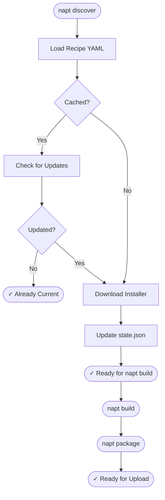

# NAPT - Not a Pkg Tool

> **Automated Windows application packaging and deployment to Microsoft Intune using PSAppDeployToolkit**

[](https://www.gnu.org/licenses/gpl-3.0)
[](https://www.python.org/downloads/)
[](https://github.com/psf/black)

## Overview

NAPT is a Python-based CLI tool that automates the entire workflow for packaging Windows applications and deploying them to Microsoft Intune. It eliminates repetitive manual work through declarative YAML-based recipes and intelligent version discovery.

📚 **[Full Documentation](https://rogercibrian.github.io/notapkgtool/)** | [Quick Start](https://rogercibrian.github.io/notapkgtool/quick-start/) | [User Guide](https://rogercibrian.github.io/notapkgtool/user-guide/) | [API Reference](https://rogercibrian.github.io/notapkgtool/api/core/)

### Key Features

- ✅ **Declarative YAML recipes** - Define app packaging once, run everywhere
- ✅ **Automatic version discovery** - Extract versions from MSI, EXE, URLs, or APIs
- ✅ **Robust downloads** - Retry logic, conditional requests (ETags), atomic writes
- ✅ **Smart caching** - Skip unnecessary downloads with intelligent version checks
- ✅ **Cross-platform support** - Windows, Linux, and macOS
- ✅ **Layered configuration** - Organization → Vendor → Recipe inheritance
- ✅ **PSADT packaging** - Generate Intune-ready packages with PSAppDeployToolkit
- 🚧 **Direct Intune upload** - Automatic deployment (planned)
- 🚧 **Deployment waves** - Phased rollouts with rings (planned)

## Quick Example

```bash
# Validate a recipe
napt validate recipes/Google/chrome.yaml

# Discover version and download installer
napt discover recipes/Google/chrome.yaml

# Build PSADT package
napt build recipes/Google/chrome.yaml

# Create .intunewin package
napt package builds/napt-chrome/141.0.7390.123/
```

> **💡 Tip:** Add `--verbose` for progress updates or `--debug` for detailed diagnostics. See [Commands Reference](https://rogercibrian.github.io/notapkgtool/user-guide/#commands-reference) for details.

## Getting Started

Ready to get started? Check out the [Quick Start Guide](https://rogercibrian.github.io/notapkgtool/quick-start/) for installation instructions and your first steps with NAPT.

## How It Works

NAPT automates the complete packaging workflow with intelligent caching to skip unnecessary work:

<div align="center">



</div>

See the [User Guide](https://rogercibrian.github.io/notapkgtool/user-guide/) for detailed architecture information and the [API Reference](https://rogercibrian.github.io/notapkgtool/api/core/) for code-level documentation.

## Cross-Platform Support

NAPT works on Windows, Linux, and macOS with full feature parity.

| Platform | Status |
|----------|--------|
| **Windows** | ✅ Fully Supported |
| **Linux** | ✅ Fully Supported |
| **macOS** | ✅ Fully Supported |

See the [Cross-Platform Support](https://rogercibrian.github.io/notapkgtool/user-guide/#cross-platform-support) section for technical details on MSI extraction backends.

## Creating Recipes

Recipes are declarative YAML files that define how to discover, download, and package applications.

**Example recipes:**

- **[chrome.yaml](https://github.com/RogerCibrian/notapkgtool/blob/main/recipes/Google/chrome.yaml)** - HTTP static strategy with MSI version extraction
- **[git.yaml](https://github.com/RogerCibrian/notapkgtool/blob/main/recipes/Git/git.yaml)** - GitHub release strategy with asset pattern matching
- **[json-api-example.yaml](https://github.com/RogerCibrian/notapkgtool/blob/main/recipes/Examples/json-api-example.yaml)** - HTTP JSON API strategy

NAPT supports multiple discovery strategies (http_static, url_regex, github_release, http_json) - see the [Discovery Strategies](https://rogercibrian.github.io/notapkgtool/user-guide/#discovery-strategies) guide for detailed configuration and examples.

## Contributing

Contributions are welcome! Please ensure:

1. Code follows existing patterns and conventions
2. All functions have comprehensive docstrings
3. Type annotations are included
4. Tests are added for new features
5. Documentation is updated

See [Contributing](https://rogercibrian.github.io/notapkgtool/contributing/) for detailed guidelines.

## License

This project is licensed under the GNU General Public License v3.0 - see the [LICENSE](https://github.com/RogerCibrian/notapkgtool/blob/main/LICENSE) file for details.

## Author

**Roger Cibrian**

## Acknowledgments

- Built for automating Windows application deployment
- Uses PSAppDeployToolkit (PSADT) for packaging
- Targets Microsoft Intune for distribution

