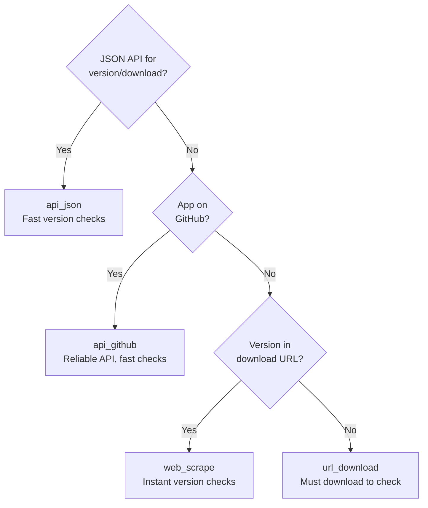
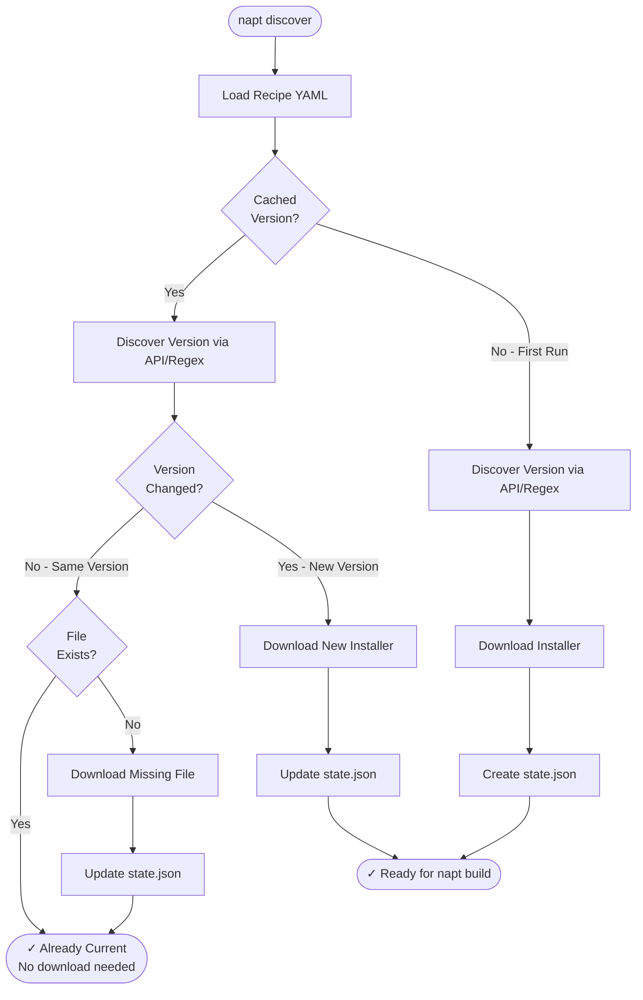
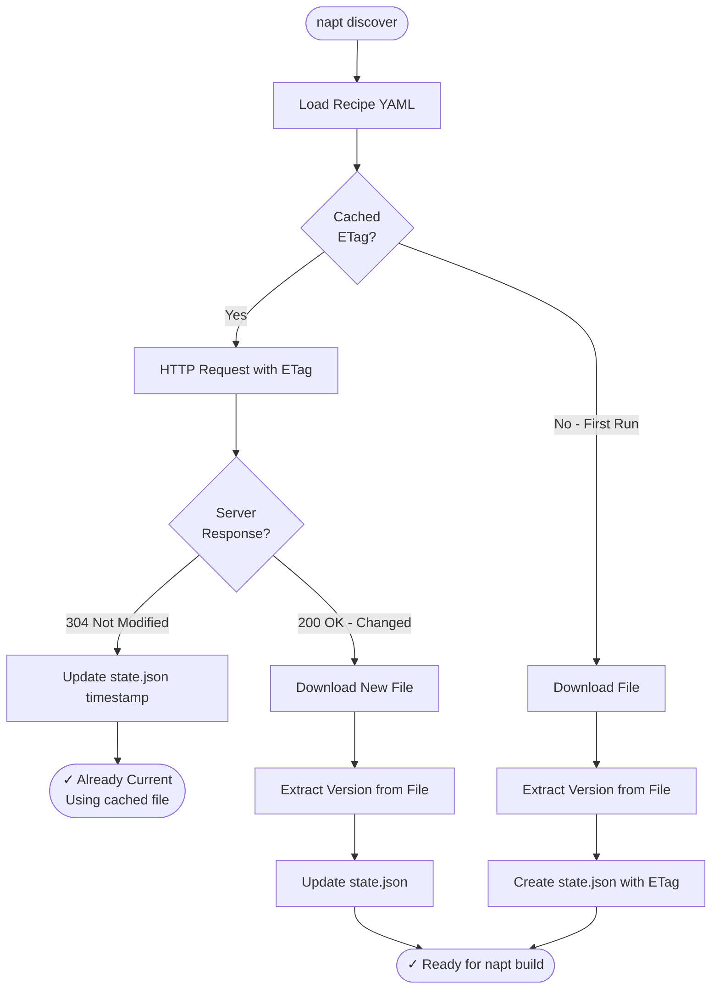

# User Guide

This guide covers NAPT's key features, configuration system, and advanced usage patterns.

## Commands Reference

### napt validate

Validates recipe syntax and configuration without making network calls.

```bash
napt validate recipes/Google/chrome.yaml [--verbose]
```

**Purpose:**

- Quick feedback during recipe development
- CI/CD pre-checks
- Syntax validation

**What it checks:**

- YAML syntax is valid
- Required fields present (apiVersion, apps, source)
- Discovery strategy exists and is registered
- Strategy-specific configuration is valid

**What it doesn't check:**

- URLs are accessible
- Files can be downloaded
- Version extraction will work

### napt discover

Discovers the latest version by downloading the installer and extracting version information.

```bash
napt discover recipes/Google/chrome.yaml [OPTIONS]

Options:
  --output-dir DIR      Download directory (default: ./downloads)
  --state-file FILE     State file path (default: state/versions.json)
  --stateless           Disable state tracking
  -v, --verbose         Show progress and status updates
  -d, --debug           Show detailed debugging output
```

**Features:**

- ✅ Discovers version using configured strategy
- ✅ Downloads installer (or HTTP 304 if cached)
- ✅ Extracts version from downloaded file
- ✅ Updates state file with ETag caching
- ✅ SHA-256 hash verification

### napt build

Builds a complete PSADT package from a recipe and downloaded installer.

```bash
napt build recipes/Google/chrome.yaml [OPTIONS]

Options:
  --downloads-dir DIR   Installer directory (default: ./downloads)
  --output-dir DIR      Build output directory (default: ./builds)
  -v, --verbose         Show progress
  -d, --debug           Show detailed output
```

**Features:**

- ✅ Downloads PSADT release from GitHub (or uses cached version)
- ✅ Extracts version from installer file
- ✅ Generates Invoke-AppDeployToolkit.ps1 from template
- ✅ Merges organization defaults with recipe-specific values
- ✅ Inserts recipe install/uninstall code
- ✅ Applies custom branding (logo, banner)
- ✅ Creates versioned build directories

### napt package

Creates a .intunewin package from a built PSADT directory.

```bash
napt package BUILD_DIR [OPTIONS]

Options:
  --output-dir DIR      Output directory (default: packages/{app_id}/)
  --clean-source        Remove build directory after packaging
  -v, --verbose         Show progress
  -d, --debug           Show detailed output
```

**Features:**

- ✅ Downloads IntuneWinAppUtil.exe (or uses cached version)
- ✅ Validates build structure before packaging
- ✅ Creates .intunewin file for Intune deployment
- ✅ Optional source cleanup

### Output Modes

All commands support verbosity flags to control output detail:

| Flag | What it shows |
|------|---------------|
| (none) | Clean output with step indicators `[1/4]` and progress |
| `--verbose` or `-v` | + HTTP requests/responses, file operations, SHA-256 hashes, configuration loading |
| `--debug` or `-d` | + Full YAML config dumps (org/vendor/recipe/merged), backend selection details, regex match groups |

Debug mode includes all verbose output plus deep diagnostic information. Use `--verbose` for normal troubleshooting and `--debug` when you need to understand exactly what NAPT is doing internally.

## Discovery Strategies

Discovery strategies are the core mechanism for obtaining application installers and extracting version information.

### Available Strategies

| Strategy | Version Source | Use Case | Unchanged Check |
|----------|---------------|----------|-----------------|
| **web_scrape** | Download page | Vendors without APIs | Fast (page scrape + regex) |
| **api_json** | JSON API | REST APIs with metadata | Fast (API call ~100ms) |
| **api_github** | Git tags | GitHub-hosted releases | Fast (GitHub API ~100ms) |
| **url_download** | File metadata | Fixed URLs, MSI installers | Medium (HTTP conditional ~500ms) |

### url_download

**Best for:**

- Vendors with stable download URLs (Chrome, Firefox enterprise)
- MSI installers with ProductVersion embedded
- When version isn't in URL or easily parseable

**Configuration:**

```yaml
source:
  strategy: url_download
  url: "https://dl.google.com/chrome/install/googlechromestandaloneenterprise64.msi"
  version:
    type: msi
```

**Pros:** Simple and reliable, version directly from installer (most accurate)  
**Cons:** Must download file to know version, slower update checks (HTTP conditional request)

### web_scrape

**Best for:**

- URLs with version numbers embedded (e.g., `app-v1.2.3.msi`)
- When version is in download URL path
- Fast version checks without downloads

**Configuration:**

```yaml
source:
  strategy: web_scrape
  url: "https://vendor.com/app-v1.2.3-setup.msi"
  pattern: "app-v(?P<version>[0-9.]+)-setup"
```

**Pros:** Know version before download, instant update checks (regex only, zero network), bandwidth-efficient  
**Cons:** Relies on URL format stability

### api_github

**Best for:**

- Open-source projects on GitHub (Git, VS Code, Node.js)
- Projects with GitHub releases and release assets
- Semantic versioned tags

**Configuration:**

```yaml
source:
  strategy: api_github
  repo: "git-for-windows/git"
  asset_pattern: "Git-.*-64-bit\\.exe$"
  version_pattern: "v?([0-9.]+)"
```

**Pros:** Official GitHub API, reliable, fast update checks (API only, ~100ms), supports authentication  
**Cons:** GitHub API rate limits (60/hour unauthenticated)

### api_json

**Best for:**

- Vendors with JSON REST APIs (Microsoft, Mozilla)
- Cloud services with version endpoints
- APIs requiring authentication or custom headers

**Configuration:**

```yaml
source:
  strategy: api_json
  api_url: "https://vendor.com/api/latest"
  version_path: "version"
  download_url_path: "download_url"
  headers:
    Authorization: "Bearer ${API_TOKEN}"
```

**Pros:** Fast update checks (API only, ~100ms), flexible, supports complex APIs, no file parsing  
**Cons:** Requires vendor API availability

### Decision Guide

Use this flowchart to choose the right strategy:



**Performance Note**: Version-first strategies (everything except url_download) can skip downloads entirely when versions haven't changed, making them ideal for scheduled CI/CD checks.

## State Management & Caching

NAPT automatically tracks discovered versions and optimizes subsequent runs by avoiding unnecessary downloads.

### How It Works

NAPT uses different caching approaches based on the discovery strategy, enabling significant performance and bandwidth savings:

- **Version-First** (web_scrape, api_github, api_json): Checks version via API/regex (~100ms or instant) before downloading. If unchanged and file exists, skips download entirely - saving 60+ MB bandwidth and minutes of time on every check.
- **File-First** (url_download): Uses HTTP conditional requests (ETags) to check if file changed. If server returns 304 Not Modified (~500ms), uses cached file without re-downloading.

This intelligent caching is critical for CI/CD with frequent scheduled checks, dramatically reducing bandwidth costs and load on vendor CDNs while providing near-instant feedback when applications haven't changed.

### Detailed Workflow

#### Version-First Strategies (web_scrape, api_github, api_json)

These strategies discover the version **before** downloading, enabling instant cache checks:



**Key optimization:** Version discovered via API/regex (~100ms or instant) **before** downloading. If unchanged and file exists, skip download entirely.

#### File-First Strategy (url_download)

This strategy must download (or check) the file first to extract the version:



**Key optimization:** HTTP conditional request with ETag (~500ms). Server returns 304 Not Modified if unchanged, avoiding re-download. Version extracted **after** download/check.

#### Performance Comparison

| Scenario | Version-First | File-First |
|----------|--------------|------------|
| **First run** | API call + Download | Download only |
| **Unchanged (most common)** | ~100ms API call (or instant regex) | ~500ms HTTP conditional request |
| **Changed** | API call + Download | Full download |

**Recommendation:** Use version-first strategies (web_scrape, api_github, api_json) when available for fastest cache checks.

### Default Behavior (Stateful)

```bash
# State tracking enabled by default
napt discover recipes/Google/chrome.yaml

# Creates/updates: state/versions.json
```

### Stateless Mode

```bash
# Disable state tracking for one-off checks
napt discover recipes/Google/chrome.yaml --stateless

# Always downloads, no caching
# Useful for CI/CD clean builds
```

## Configuration Layers

NAPT uses a sophisticated 3-layer configuration system that promotes DRY (Don't Repeat Yourself) principles:

### The Three Layers

1. **Organization defaults** (`defaults/org.yaml`) - Base configuration for all apps. Required if a defaults directory is found. Contains PSADT settings, update policies, and deployment waves.

2. **Vendor defaults** (`defaults/vendors/<Vendor>.yaml`) - Vendor-specific overrides. Optional; only loaded if vendor is detected (e.g., Google-specific settings).

3. **Recipe configuration** (`recipes/<Vendor>/<app>.yaml`) - App-specific settings. Always required; defines the specific app with final overrides.

### Merge Behavior

The loader performs deep merging with "last wins" semantics:

- **Dicts**: Recursively merged (keys from overlay override base)
- **Lists**: Completely replaced (NOT appended/extended)
- **Scalars**: Overwritten (strings, numbers, booleans)

### Example

```yaml
# defaults/org.yaml
defaults:
  psadt:
    release: "latest"
    app_vars:
      AppVendor: "Unknown"
```

```yaml
# defaults/vendors/Google.yaml
defaults:
  psadt:
    app_vars:
      AppVendor: "Google LLC"
```

```yaml
# recipes/Google/chrome.yaml
apps:
  - name: "Google Chrome"
    # AppVendor will be "Google LLC" (from vendor defaults)
    # release will be "latest" (from org defaults)
```

## Cross-Platform Support

NAPT works on Windows, Linux, and macOS with full feature parity.

### Platform Compatibility Matrix

| Platform | Download | Config | CLI | MSI Extraction | Status |
|----------|----------|--------|-----|----------------|--------|
| **Windows** | ✅ | ✅ | ✅ | ✅ Native (PowerShell COM) | Fully Supported |
| **Linux** | ✅ | ✅ | ✅ | ✅ Via msitools | Fully Supported |
| **macOS** | ✅ | ✅ | ✅ | ✅ Via msitools | Fully Supported |

### MSI Extraction Backends

**Windows** (tried in order):

1. `msilib` (Python standard library)
2. `_msi` (CPython extension)
3. **PowerShell COM** (always available, universal fallback)

**Linux/macOS**:

1. `msiinfo` from msitools package

The PowerShell fallback makes MSI extraction truly universal on Windows systems, even when Python MSI libraries aren't available.

## Programmatic API

NAPT can be used as a Python library for automation and integration.

### Basic Usage

```python
from pathlib import Path
from notapkgtool.core import discover_recipe
from notapkgtool.validation import validate_recipe
from notapkgtool.config import load_effective_config

# Validate recipe syntax (no downloads)
result = validate_recipe(
    recipe_path=Path("recipes/Google/chrome.yaml"),
    verbose=True
)
print(f"Status: {result['status']}")

# Discover version and download installer
result = discover_recipe(
    recipe_path=Path("recipes/Google/chrome.yaml"),
    output_dir=Path("./downloads"),
    verbose=True
)
print(f"Version: {result['version']}")
print(f"SHA-256: {result['sha256']}")

# Load configuration
config = load_effective_config(Path("recipes/Google/chrome.yaml"))
```

### Version Comparison

```python
from notapkgtool.versioning import compare_any, is_newer_any

# Compare versions
if is_newer_any("1.2.0", "1.1.9"):
    print("Update available!")

# Detailed comparison
result = compare_any("2.0.0", "1.9.9")
# Returns: 1 (newer), 0 (same), or -1 (older)
```

See the [API Reference](api/core.md) for complete documentation.

## Best Practices

### Recipe Organization

```
recipes/
├── <Vendor>/
│   ├── <app1>.yaml
│   ├── <app2>.yaml
│   └── ...
```

### Vendor Detection

NAPT automatically detects vendor from directory structure:

- `recipes/Google/chrome.yaml` → Vendor: "Google"
- Loads `defaults/vendors/Google.yaml` if it exists

### State Management

For production use:

- ✅ Keep state tracking enabled (default)
- ✅ Use version control for state files
- ✅ Run on schedule to detect updates
- ✅ Use `--verbose` in CI/CD for debugging

For development:

- Use `--stateless` for testing
- Use `--debug` for troubleshooting
- Delete state file to force re-discovery

### Error Handling

All commands return proper exit codes:

- `0` = Success
- `1` = Error (configuration, download, validation failure)

Use in scripts:

```bash
if napt discover recipes/Google/chrome.yaml; then
    napt build recipes/Google/chrome.yaml
else
    echo "Discovery failed"
    exit 1
fi
```

## Troubleshooting

### Common Issues

**Problem**: "Command not found: napt"

```bash
# Solution 1: Activate Poetry shell
poetry shell

# Solution 2: Use poetry run prefix
poetry run napt --version
```

**Problem**: MSI extraction fails on Linux/macOS

```bash
# Solution: Install msitools
sudo apt-get install msitools  # Debian/Ubuntu
brew install msitools           # macOS
```

**Problem**: State file corrupted

```bash
# NAPT automatically creates backup
# Backup saved to: state/versions.json.backup

# Force re-download
napt discover recipes/app.yaml --stateless
```

**Problem**: GitHub API rate limit

```bash
# Solution: Use authentication token
# In recipe:
source:
  strategy: api_github
  token: "${GITHUB_TOKEN}"

# Set environment variable
export GITHUB_TOKEN="your_token_here"
```

### Debug Mode

Always use `--debug` for troubleshooting:

```bash
napt discover recipes/Google/chrome.yaml --debug
```

This shows:

- Full configuration dumps
- HTTP request/response details
- Backend selection (MSI extraction method)
- File operations with paths
- Complete error tracebacks

