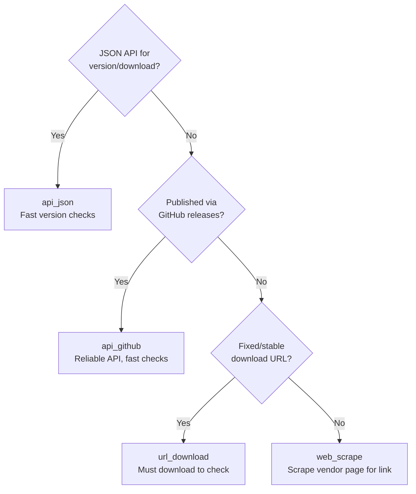
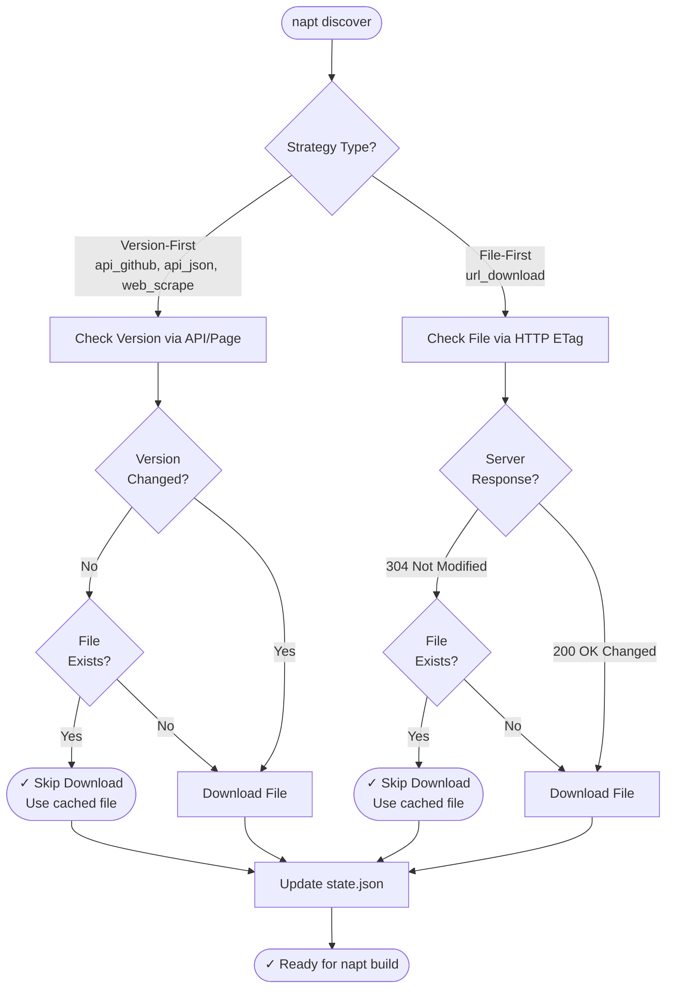

# User Guide

This guide covers NAPT's key features, configuration system, and advanced usage patterns.

## How NAPT Works

NAPT automates the complete workflow from version discovery to Intune package creation. Understanding how each step works helps you troubleshoot issues and customize recipes effectively.

### Discovery Process (`napt discover`)

The discovery process finds the latest version and downloads the installer:

1. **Load Configuration** - Merges organization defaults, vendor defaults, and recipe configuration
2. **Check Version** - Uses the configured discovery strategy to check for new versions
3. **Compare with Cache** - Compares discovered version to cached `known_version` in state file
4. **Skip or Download**:
    - If version unchanged and file exists → Skip download 
    - If version changed or file missing → Download installer
5. **Extract Version** - Extracts version from installer (MSI ProductVersion) or uses discovered version
6. **Update State** - Updates `state/versions.json` with new version, file path, SHA-256 hash, and ETag (if download occurred). 

**Output**: Downloaded installer in `downloads/` directory, updated state file

### Build Process (`napt build`)

The build process creates a complete PSADT package from the recipe and downloaded installer:

1. **Load Configuration** - Merges configuration layers (org → vendor → recipe)
2. **Find Installer** - Locates installer in `downloads/` directory (tries URL filename, then app name/id, then most recent)
3. **Extract Version** - Extracts version from installer file (MSI files auto-detected by extension), otherwise uses state file version
4. **Get PSADT Release** - Downloads/caches PSADT Template_v4 from GitHub if not already cached
5. **Create Build Directory** - Creates versioned directory using discovered app version: `builds/{app_id}/{version}/`
6. **Copy PSADT Template** - Copies entire PSADT template structure (unmodified) from cache:
    - `PSAppDeployToolkit/` - Core PSADT module
    - `PSAppDeployToolkit.Extensions/` - Extension modules
    - `Assets/` - Default icons and banners
    - `Config/` - Default configuration files
    - `Strings/` - Localization strings
    - `Files/` - Empty directory for installer files
    - `SupportFiles/` - Empty directory for additional files
    - `Invoke-AppDeployToolkit.exe` - Compiled launcher
    - `Invoke-AppDeployToolkit.ps1` - Template script (will be overwritten)
7. **Generate Deployment Script** - Generates `Invoke-AppDeployToolkit.ps1` from template:
    - Substitutes PSADT variables (`$appVendor`, `$appName`, `$appVersion`, etc.) from recipe configuration
    - Inserts install script from `psadt.install` field
    - Inserts uninstall script from `psadt.uninstall` field
    - Sets dynamic values (AppScriptDate, discovered version, PSADT version)
    - Preserves PSADT's structure and comments
8. **Copy Installer** - Copies downloaded installer file to `Files/` directory:
    - Source: `downloads/{installer_filename}`
    - Destination: `builds/{app_id}/{version}/Files/{installer_filename}`
    - Installer is accessible in scripts via `$dirFiles` variable
9. **Apply Branding** - Replaces PSADT default assets with custom branding (if configured):
    - Reads `brand_pack` configuration from org/vendor defaults
    - Replaces files in `Assets/` directory (AppIcon.png, Banner.Classic.png, etc.)
    - Uses pattern matching to find source files in brand pack directory
10. **Generate Detection and Requirements Scripts** - Creates PowerShell scripts for Intune Win32 app deployment (detection always generated; requirements only when `build_types` is `both` or `update_only`). See [Detection and Requirements Scripts](#detection-and-requirements-scripts) below for details.

**Output**: Complete PSADT package in `builds/{app_id}/{version}/` with detection script always present, and requirements script when `build_types` is `both` or `update_only`.

#### Detection and Requirements Scripts

NAPT generates PowerShell scripts used by Intune Win32 app entries to check installation state:

- **Detection script** (always generated): Used by the **App** entry and by the **Update** entry when using the two-app model to determine if the app is installed at the expected version. Filename: `{AppName}_{Version}-Detection.ps1`.
- **Requirements script** (when `build_types` is `both` or `update_only`): Used by the **Update** entry to determine if an older version is installed so Intune can offer the update. Filename: `{AppName}_{Version}-Requirements.ps1`.

Both scripts share the same logic for registry lookup, app name resolution, and installer-type filtering; they differ only in how they interpret the version comparison (see below).

**How the scripts work:**

- **Registry locations checked (architecture-aware):**
    - Scripts use explicit `RegistryView` (Registry64 or Registry32) for deterministic behavior regardless of PowerShell process bitness
    - **For x64/arm64 architecture** (or 64-bit view when architecture is "any"):
        - `HKLM:\SOFTWARE\Microsoft\Windows\CurrentVersion\Uninstall` (machine-level)
        - `HKCU:\SOFTWARE\Microsoft\Windows\CurrentVersion\Uninstall` (user-level)
    - **For x86 architecture** (or 32-bit view when architecture is "any" on 64-bit OS):
        - `HKLM:\SOFTWARE\WOW6432Node\Microsoft\Windows\CurrentVersion\Uninstall` (machine-level)
        - `HKCU:\SOFTWARE\Wow6432Node\Microsoft\Windows\CurrentVersion\Uninstall` (user-level)
    - **For x86 architecture on 32-bit OS**:
        - `HKLM:\SOFTWARE\Microsoft\Windows\CurrentVersion\Uninstall` (machine-level)
        - `HKCU:\SOFTWARE\Microsoft\Windows\CurrentVersion\Uninstall` (user-level)
    - **When architecture is "any"** (default): Checks both 64-bit and 32-bit views (all applicable paths above)

- **App name determination:**
    - **MSI installers:** Uses MSI `ProductName` property (authoritative source for registry DisplayName). For MSIs where the vendor includes version in the ProductName (e.g., "7-Zip 25.01"), use `win32.installed_check.override_msi_display_name: true` to specify a custom `display_name` pattern instead. See [Recipe Reference - Win32 Configuration](recipe-reference.md#override_msi_display_name) for details.
    - **Non-MSI installers:** Requires `win32.installed_check.display_name` in recipe configuration. Scripts match registry `DisplayName` to this value.

- **Installer type filtering:**
    - **MSI installers (strict):** Only match registry entries that are MSI-based (checks `WindowsInstaller` = 1). Prevents false matches when both MSI and EXE versions exist.
    - **Non-MSI installers (permissive):** Match any registry entry (MSI or non-MSI) to handle EXE installers that run embedded MSIs internally.

- **Architecture filtering:**
    - Controls which registry views are checked based on the `AppArch` value from `psadt.app_vars` in the recipe
    - **MSI installers:** AppArch is automatically extracted from MSI package metadata during discovery (no manual configuration needed)
    - **Non-MSI installers:** AppArch must be explicitly specified in `psadt.app_vars` (e.g., `AppArch: "x64"`)
    - **Architecture values:**
        - `x64` / `arm64`: Checks only 64-bit registry view (ARM64 uses 64-bit registry)
        - `x86`: Checks only 32-bit registry view
        - `any` (default if not specified): Checks both 64-bit and 32-bit views for maximum compatibility
    - Uses explicit `RegistryView` API for deterministic behavior regardless of PowerShell process bitness
    - Prevents false matches when both 32-bit and 64-bit versions of the same software are installed

- **Logging:**
    - **Format:** CMTrace format for compatibility with Intune diagnostics tools
    - **Primary locations:**
        - System context: `C:\ProgramData\Microsoft\IntuneManagementExtension\Logs\`
        - User context: `C:\ProgramData\Microsoft\IntuneManagementExtension\Logs\`
        - Detection: `NAPTDetections.log` (system) / `NAPTDetectionsUser.log` (user)
        - Requirements: `NAPTRequirements.log` (system) / `NAPTRequirementsUser.log` (user)
    - **Fallback locations** (used if primary location fails):
        - System context: `C:\ProgramData\NAPT\`
        - User context: `%LOCALAPPDATA%\NAPT\`
        - Same log file names as primary locations
    - **Fallback behavior:** Script tries primary first (creates directory if needed, verifies write access). If that fails (insufficient permissions), tries fallback. If both fail, script continues with a warning to stderr but no log file
    - **Log rotation:** 2-file rotation (.log and .log.old), default 3MB max size per file

**Detection vs Requirements scripts:**

- **Detection script** - Checks if the application is installed at the expected version:
    - Version check: Compares installed version to expected version
    - Match modes: Exact match (installed = expected) or minimum version (installed >= expected)
    - Exit codes: Exit 0 if installed and meets requirement, exit 1 otherwise
    - Used by: Both App and Update entries in Intune
- **Requirements script** - Determines if an installed application needs to be updated:
    - Version check: Determines if installed version < target version
    - Output: Writes "Required" to stdout if update needed, nothing otherwise
    - Exit codes: Always exits 0 (allows Intune to evaluate stdout)
    - Intune configuration: Requirement rule with output type String, operator Equals, value "Required"
    - Used by: Update entry only (to determine if update is applicable)

**Output location and packaging:**

Scripts are saved as siblings to the `packagefiles/` directory and are NOT included in the `.intunewin` package:

```
builds/napt-chrome/144.0.7559.110/
  ├── packagefiles/                                 # PSADT package (packaged into .intunewin)
  │   └── ...
  ├── Google-Chrome-144.0.7559.110-Detection.ps1    # Detection script
  └── Google-Chrome-144.0.7559.110-Requirements.ps1 # Requirements script (if generated)
```

**Configuration:** See [Recipe Reference - Win32 Configuration](recipe-reference.md#win32-configuration) for `win32.installed_check` and `win32.build_types` options.

### Package Process (`napt package`)

The package process creates a `.intunewin` file from the built PSADT directory:

1. **Verify Structure** - Validates build directory has required PSADT structure:
    - `PSAppDeployToolkit/` directory
    - `Files/` directory
    - `Invoke-AppDeployToolkit.ps1` script
    - `Invoke-AppDeployToolkit.exe` launcher
2. **Get IntuneWinAppUtil** - Downloads/caches `IntuneWinAppUtil.exe` from Microsoft's GitHub repository if not already cached
3. **Create Package** - Runs `IntuneWinAppUtil.exe` to create `.intunewin` file:
    - Input: Build directory (entire PSADT structure)
    - Output: `Invoke-AppDeployToolkit.intunewin` file (named by IntuneWinAppUtil.exe based on setup file)
    - Package contains all files from build directory in compressed format
4. **Optional Cleanup** - If `--clean-source` flag is used, removes the build directory after successful packaging

**Output**: `.intunewin` package file in `packages/{app_id}/` directory, ready for Intune upload

### Directory Structure

After a complete workflow, your directory structure looks like:

```
downloads/
  └── googlechromestandaloneenterprise64.msi

builds/
  └── napt-chrome/
      └── 142.0.7444.163/
          ├── packagefiles/                # PSADT package contents
          │   ├── PSAppDeployToolkit/      # PSADT module (from template)
          │   ├── PSAppDeployToolkit.Extensions/
          │   ├── Assets/                  # Custom branding (if configured)
          │   ├── Config/
          │   ├── Strings/
          │   ├── Files/                   # Installer copied here
          │   │   └── googlechromestandaloneenterprise64.msi
          │   ├── SupportFiles/            # Empty (for additional files)
          │   ├── Invoke-AppDeployToolkit.ps1  # Generated script
          │   └── Invoke-AppDeployToolkit.exe  # From template
          ├── Google-Chrome-142.0.7444.163-Detection.ps1    # App (upload separately)
          └── Google-Chrome-142.0.7444.163-Requirements.ps1 # Update (upload separately)

packages/
  └── napt-chrome/
      └── Invoke-AppDeployToolkit.intunewin

state/
  └── versions.json                        # Version tracking
```

## Commands Reference

> **💡 Tip:** All commands support `--help` (or `-h`) to show detailed usage, options, and examples. Try `napt discover --help` to see what's available.

### napt validate

Validates recipe syntax and configuration without making network calls. Checks YAML syntax, required fields, and strategy configuration. Does not verify URLs are accessible or files can be downloaded.

```bash
napt validate recipes/Google/chrome.yaml [OPTIONS]
```

### napt discover

Discovers the latest version and downloads the installer. Uses version-based caching to skip downloads when versions haven't changed.

```bash
napt discover recipes/Google/chrome.yaml [OPTIONS]
```

### napt build

Builds a complete PSADT package from a recipe and downloaded installer. Generates deployment scripts, applies branding, and creates versioned build directories.

```bash
napt build recipes/Google/chrome.yaml [OPTIONS]
```

### napt package

Creates a .intunewin package from a built PSADT directory for Intune deployment.

```bash
napt package BUILD_DIR [OPTIONS]
```

### Output Modes

All commands support verbosity flags to control output detail:

| Flag | What it shows |
|------|---------------|
| (none) | Clean output with step indicators (e.g., `[1/4]`) and progress |
| `--verbose` or `-v` | All of the above, plus HTTP requests/responses, file operations, SHA-256 hashes, and configuration loading |
| `--debug` or `-d` | All verbose output, plus full YAML config dumps (org/vendor/recipe/merged), backend selection details, and regex match groups |

Debug mode includes all verbose output plus deep diagnostic information. Use `--verbose` for normal troubleshooting and `--debug` when you need to understand exactly what NAPT is doing internally.

## Discovery Strategies

Discovery strategies are the core mechanism for obtaining application installers and extracting version information.

### Available Strategies

| Strategy | Version Source | Use Case | Unchanged Version Detection Speed |
|----------|---------------|----------|---------------------|
| **api_github** | Git tags | GitHub-hosted releases | Fast (GitHub API ~100ms) |
| **api_json** | JSON API | REST APIs with metadata | Fast (API call ~100ms) |
| **url_download** | File metadata | Fixed URLs, MSI installers | Medium (HTTP conditional ~500ms) |
| **web_scrape** | Download page | Vendors without APIs | Fast (page scrape + regex) |

> **Note:** For complete configuration examples and field documentation for each strategy, see [Recipe Reference](recipe-reference.md).

### Decision Guide

Use this flowchart to choose the right strategy:



**Performance Note**: Version-first strategies (everything except url_download) can skip downloads entirely when versions haven't changed, making them ideal for scheduled CI/CD checks.

## Recipe Basics

A recipe file defines how to discover, download, and package an application. Recipes are YAML files that specify:

- **Discovery strategy** - How to find the latest version and download URL
- **PSADT configuration** - PowerShell deployment scripts and variables

### Basic Structure

```yaml
apiVersion: napt/v1  # Recipe format version

app:
  name: "Application Name"  # Display name
  id: "napt-app-id"  # Unique identifier

  source:  # Discovery configuration
      strategy: api_github  # One of: api_github, api_json, url_download, web_scrape
      # ... strategy-specific fields

  psadt:  # PSADT configuration
      app_vars:
        AppName: "Application Name"
        AppVersion: "${discovered_version}"
        AppArch: "x64"
      install: |  # Installation script
        # PowerShell code here
      uninstall: |  # Uninstallation script
        # PowerShell code here
```

### Quick Reference

- **Top-level fields:** `apiVersion` (required), `app` (required)
- **App fields:** `name` (required), `id` (required), `source` (required), `psadt` (required)
- **Discovery strategies:** See [Discovery Strategies](#discovery-strategies) section above for strategy selection and examples
- **PSADT scripts:** Use `${discovered_version}` for auto-substituted version, `$dirFiles` for installer path

### Complete Documentation

For complete field documentation, all options, and detailed examples, see the [Recipe Reference](recipe-reference.md) page.

For practical workflows and copy-paste examples, see [Common Tasks](common-tasks.md).

## State Management & Caching

NAPT automatically tracks discovered versions and optimizes subsequent runs by avoiding unnecessary downloads. This version-based caching is critical for CI/CD with frequent scheduled checks, providing fast feedback when applications haven't changed.

### How It Works

NAPT uses two caching approaches depending on the discovery strategy:



**Performance:** Version-first strategies (api_github, api_json, web_scrape) check versions before downloading (~100-300ms) and skip downloads entirely if unchanged. File-first strategy (url_download) uses HTTP conditional requests (~500ms) with ETag caching.

**Note:** State is updated after every discovery run, even when skipping downloads. This updates the `last_updated` timestamp and confirms the cached version is still current.

### Default Behavior (Stateful)

```bash
# State tracking enabled by default
napt discover recipes/Google/chrome.yaml

# Creates/updates: state/versions.json
```

### Stateless Mode

```bash
# Disable state tracking for one-off checks
napt discover recipes/Google/chrome.yaml --stateless

# Always downloads, no caching
# Useful for CI/CD clean builds
```

## Configuration Layers

NAPT uses a sophisticated 3-layer configuration system that promotes DRY (Don't Repeat Yourself) principles:

### The Three Layers

1. **Organization defaults** (`defaults/org.yaml`) - Base configuration for all apps. Required if a defaults directory is found. Contains PSADT settings, update policies, and deployment waves.

2. **Vendor defaults** (`defaults/vendors/<Vendor>.yaml`) - Vendor-specific overrides. Optional; only loaded if vendor is detected (e.g., Google-specific settings).

3. **Recipe configuration** (`recipes/<Vendor>/<app>.yaml`) - App-specific settings. Always required; defines the specific app with final overrides. Any field defined in higher layers can be overridden.

### Example

```yaml
# defaults/org.yaml
defaults:
  psadt:
    release: "latest"
    app_vars:
      AppVendor: "Unknown"
```

```yaml
# defaults/vendors/Google.yaml
defaults:
  psadt:
    app_vars:
      AppVendor: "Google LLC"
```

```yaml
# recipes/Google/chrome.yaml
app:
  name: "Google Chrome"
  # AppVendor will be "Google LLC" (from vendor defaults)
  # release will be "latest" (from org defaults)
```

## Cross-Platform Support

**NAPT is a Windows tool** for Microsoft Intune packaging. Develop on any platform, package on Windows.

### Platform Compatibility Matrix

| Platform | Discover & Download | Build | Package |
|----------|---------------------|-------|---------|
| **Windows** | ✅ | ✅ | ✅ |
| **Linux** | ✅ | ✅ | ⚫ Windows Only |
| **macOS** | ✅ | ✅ | ⚫ Windows Only |

### Why Windows for Packaging?

The `napt package` command uses Microsoft's [IntuneWinAppUtil.exe](https://github.com/microsoft/Microsoft-Win32-Content-Prep-Tool), which is a Windows-only .NET application. This is the official tool for creating .intunewin packages.

### Recommended Workflows

#### Workflow 1: All-Windows (Simplest)
```bash
# Run everything on Windows
napt discover recipes/Google/chrome.yaml
napt build recipes/Google/chrome.yaml
napt package builds/napt-chrome/144.0.7559.110/
```

#### Workflow 2: Mixed Platform Development
```bash
# On Linux/macOS: Discovery and build
napt discover recipes/Google/chrome.yaml
napt build recipes/Google/chrome.yaml

# Transfer build directory to Windows (e.g., via shared storage)
# On Windows: Package
napt package builds/napt-chrome/144.0.7559.110/
```

## Best Practices

### Recipe Organization

Organize recipes by vendor: `recipes/<Vendor>/<app>.yaml`. NAPT automatically detects vendor from directory structure and loads `defaults/vendors/<Vendor>.yaml` if it exists.

### State Management

**Production:** Keep state tracking enabled (default), use version control for state files, run on schedule to detect updates, use `--verbose` in CI/CD.

**Development:** Use `--stateless` for testing, `--debug` for troubleshooting, delete state file to force re-discovery.

### Scripting

All commands return standard exit codes (`0` = success, `1` = error), making them easy to use in automation scripts:

```bash
if napt discover recipes/Google/chrome.yaml; then
    napt build recipes/Google/chrome.yaml
fi
```

## Troubleshooting

### Common Issues

**Problem**: MSI extraction fails on Linux/macOS

```bash
# Solution: Install msitools
sudo apt-get install msitools  # Debian/Ubuntu
brew install msitools           # macOS
```

**Problem**: State file corrupted

```bash
# NAPT automatically creates backup
# Backup saved to: state/versions.json.backup

# Force re-download
napt discover recipes/app.yaml --stateless
```

**Problem**: GitHub API rate limit

> **⚠️ Security Note:** Never put tokens directly in recipe files (e.g., `token: "ghp_abc123"`). Always use environment variable substitution (`token: "${GITHUB_TOKEN}"`) to keep tokens out of version control. See [Handle Authentication Tokens](common-tasks.md#handle-authentication-tokens) for best practices.

```yaml
# Solution: Use authentication token via environment variable
source:
  strategy: api_github
  token: "${GITHUB_TOKEN}"  # Environment variable substitution (secure)
```

```powershell
# Set environment variable on Windows:
$env:GITHUB_TOKEN="your_token_here"
```
```bash
# Set environment variable on Linux/macOS: 
export GITHUB_TOKEN="your_token_here"
```


