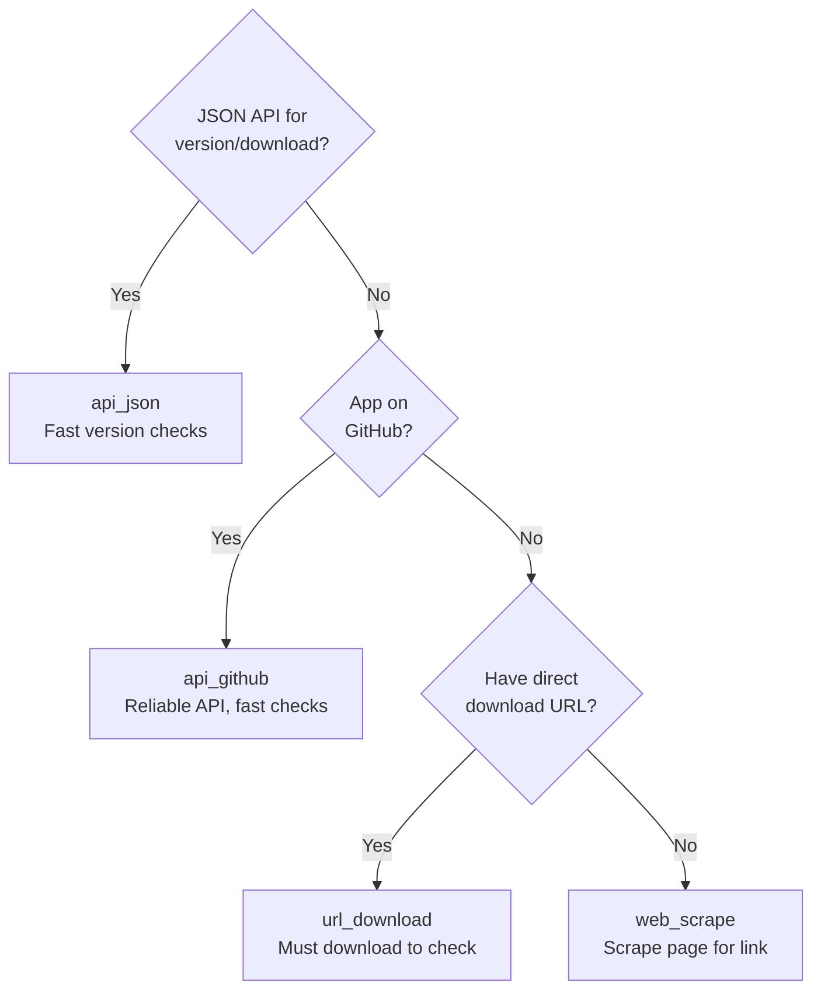

# User Guide

This guide covers NAPT's key features, configuration system, and advanced usage patterns.

## How NAPT Works

NAPT automates the complete workflow from version discovery to Intune package creation. Understanding how each step works helps you troubleshoot issues and customize recipes effectively.

### Discovery Process (`napt discover`)

The discovery process finds the latest version and downloads the installer:

1. **Load Configuration** - Merges organization defaults, vendor defaults, and recipe configuration
2. **Check Version** - Uses the configured discovery strategy to check for new versions
3. **Compare with Cache** - Compares discovered version to cached `known_version` in state file
4. **Skip or Download**:
    - If version unchanged and file exists → Skip download 
    - If version changed or file missing → Download installer
5. **Extract Version** - Extracts version from installer (MSI ProductVersion) or uses discovered version
6. **Update State** - Updates `state/versions.json` with new version, file path, SHA-256 hash, and ETag (if download occurred). 

**Output**: Downloaded installer in `downloads/` directory, updated state file

### Build Process (`napt build`)

The build process creates a complete PSADT package from the recipe and downloaded installer:

1. **Load Configuration** - Merges configuration layers (org → vendor → recipe)
2. **Find Installer** - Locates installer in `downloads/` directory (tries URL filename, then app name/id, then most recent)
3. **Extract Version** - Extracts version from installer file (MSI files auto-detected by extension), otherwise uses state file version
4. **Get PSADT Release** - Downloads/caches PSADT Template_v4 from GitHub if not already cached
5. **Create Build Directory** - Creates versioned directory using discovered app version: `builds/{app_id}/{version}/`
6. **Copy PSADT Template** - Copies entire PSADT template structure (unmodified) from cache:
    - `PSAppDeployToolkit/` - Core PSADT module
    - `PSAppDeployToolkit.Extensions/` - Extension modules
    - `Assets/` - Default icons and banners
    - `Config/` - Default configuration files
    - `Strings/` - Localization strings
    - `Files/` - Empty directory for installer files
    - `SupportFiles/` - Empty directory for additional files
    - `Invoke-AppDeployToolkit.exe` - Compiled launcher
    - `Invoke-AppDeployToolkit.ps1` - Template script (will be overwritten)
7. **Generate Deployment Script** - Generates `Invoke-AppDeployToolkit.ps1` from template:
    - Substitutes PSADT variables (`$appVendor`, `$appName`, `$appVersion`, etc.) from recipe configuration
    - Inserts install script from `psadt.install` field
    - Inserts uninstall script from `psadt.uninstall` field
    - Sets dynamic values (AppScriptDate, discovered version, PSADT version)
    - Preserves PSADT's structure and comments
8. **Copy Installer** - Copies downloaded installer file to `Files/` directory:
    - Source: `downloads/{installer_filename}`
    - Destination: `builds/{app_id}/{version}/Files/{installer_filename}`
    - Installer is accessible in scripts via `$dirFiles` variable
9. **Apply Branding** - Replaces PSADT default assets with custom branding (if configured):
    - Reads `brand_pack` configuration from org/vendor defaults
    - Replaces files in `Assets/` directory (AppIcon.png, Banner.Classic.png, etc.)
    - Uses pattern matching to find source files in brand pack directory
10. **Generate Detection Script** - Creates PowerShell detection script for Intune Win32 app deployment:
    - Extracts app name from MSI ProductName (for MSI installers) or uses detection.display_name (for non-MSI installers)
    - Generates script that checks Windows uninstall registry keys
    - Saves as `{AppName}_{Version}-Detection.ps1` sibling to `packagefiles/` directory
    - Script uses CMTrace-formatted logging
    - Configurable via `detection` section in defaults or recipe

**Output**: Complete PSADT package in `builds/{app_id}/{version}/` with detection script ready for deployment

#### Detection Scripts

NAPT automatically generates PowerShell detection scripts during the build process (step 10). These scripts are used by Microsoft Intune to determine if an application is installed and whether it meets version requirements.

**How Detection Scripts Work:**

Detection scripts check Windows uninstall registry keys for installed software:

- **Registry Locations Checked:**
    - `HKLM:\SOFTWARE\Microsoft\Windows\CurrentVersion\Uninstall` (machine-level, 64-bit)
    - `HKCU:\SOFTWARE\Microsoft\Windows\CurrentVersion\Uninstall` (user-level)
    - `HKLM:\SOFTWARE\WOW6432Node\Microsoft\Windows\CurrentVersion\Uninstall` (machine-level, 32-bit on 64-bit OS)
    - `HKCU:\SOFTWARE\Wow6432Node\Microsoft\Windows\CurrentVersion\Uninstall` (user-level, 32-bit on 64-bit OS)

- **Detection Logic:**
    - Matches by `DisplayName` (from MSI ProductName for MSI installers, or detection.display_name for non-MSI installers)
    - Compares installed version to expected version
    - Supports exact match or minimum version (installed >= expected)
    - Returns exit code 0 if installed and meets requirements, 1 otherwise

- **App Name Determination:**
    - **MSI installers:** Uses MSI `ProductName` property (authoritative source for registry DisplayName)
    - **Non-MSI installers:** Requires `detection.display_name` in recipe configuration

- **Logging:**
    - Uses CMTrace format for Intune diagnostics
    - Logs to `C:\ProgramData\Microsoft\IntuneManagementExtension\Logs\NAPTDetections.log` (system context)
    - Logs to `C:\ProgramData\Microsoft\IntuneManagementExtension\Logs\NAPTDetectionsUser.log` (user context)
    - Automatic log rotation (default: 3MB max size)
    - Fallback locations if primary locations unavailable

**Detection Script Files:**

Detection scripts are saved as siblings to the `packagefiles/` directory:

```
builds/napt-chrome/142.0.7444.163/
  ├── packagefiles/              # PSADT package (packaged into .intunewin)
  │   └── ...
  └── Google-Chrome-142.0.7444.163-Detection.ps1  # Detection script (upload separately)
```

**Important:** Detection scripts are NOT included in the `.intunewin` package. They must be uploaded separately to Intune when configuring the Win32 app. The script filename follows the pattern: `{AppName}_{Version}-Detection.ps1`.

**Configuration:**

Detection script behavior can be configured via the `detection` section in defaults or recipe. See [Recipe Reference - Detection Configuration](recipe-reference.md#detection-configuration) for complete options.

### Package Process (`napt package`)

The package process creates a `.intunewin` file from the built PSADT directory:

1. **Verify Structure** - Validates build directory has required PSADT structure:
    - `PSAppDeployToolkit/` directory
    - `Files/` directory
    - `Invoke-AppDeployToolkit.ps1` script
    - `Invoke-AppDeployToolkit.exe` launcher
2. **Get IntuneWinAppUtil** - Downloads/caches `IntuneWinAppUtil.exe` from Microsoft's GitHub repository if not already cached
3. **Create Package** - Runs `IntuneWinAppUtil.exe` to create `.intunewin` file:
    - Input: Build directory (entire PSADT structure)
    - Output: `Invoke-AppDeployToolkit.intunewin` file (named by IntuneWinAppUtil.exe based on setup file)
    - Package contains all files from build directory in compressed format
4. **Optional Cleanup** - If `--clean-source` flag is used, removes the build directory after successful packaging

**Output**: `.intunewin` package file in `packages/{app_id}/` directory, ready for Intune upload

### Directory Structure

After a complete workflow, your directory structure looks like:

```
downloads/
  └── googlechromestandaloneenterprise64.msi

builds/
  └── napt-chrome/
      └── 142.0.7444.163/
          ├── packagefiles/                # PSADT package contents
          │   ├── PSAppDeployToolkit/      # PSADT module (from template)
          │   ├── PSAppDeployToolkit.Extensions/
          │   ├── Assets/                  # Custom branding (if configured)
          │   ├── Config/
          │   ├── Strings/
          │   ├── Files/                   # Installer copied here
          │   │   └── googlechromestandaloneenterprise64.msi
          │   ├── SupportFiles/            # Empty (for additional files)
          │   ├── Invoke-AppDeployToolkit.ps1  # Generated script
          │   └── Invoke-AppDeployToolkit.exe  # From template
          └── Google-Chrome-142.0.7444.163-Detection.ps1  # Detection script (upload separately to Intune)

packages/
  └── napt-chrome/
      └── Invoke-AppDeployToolkit.intunewin

state/
  └── versions.json                        # Version tracking
```

## Commands Reference

> **💡 Tip:** All commands support `--help` (or `-h`) to show detailed usage, options, and examples. Try `napt discover --help` to see what's available.

### napt validate

Validates recipe syntax and configuration without making network calls. Checks YAML syntax, required fields, and strategy configuration. Does not verify URLs are accessible or files can be downloaded.

```bash
napt validate recipes/Google/chrome.yaml [OPTIONS]
```

### napt discover

Discovers the latest version and downloads the installer. Uses version-based caching to skip downloads when versions haven't changed.

```bash
napt discover recipes/Google/chrome.yaml [OPTIONS]
```

### napt build

Builds a complete PSADT package from a recipe and downloaded installer. Generates deployment scripts, applies branding, and creates versioned build directories.

```bash
napt build recipes/Google/chrome.yaml [OPTIONS]
```

### napt package

Creates a .intunewin package from a built PSADT directory for Intune deployment.

```bash
napt package BUILD_DIR [OPTIONS]
```

### Output Modes

All commands support verbosity flags to control output detail:

| Flag | What it shows |
|------|---------------|
| (none) | Clean output with step indicators (e.g., `[1/4]`) and progress |
| `--verbose` or `-v` | All of the above, plus HTTP requests/responses, file operations, SHA-256 hashes, and configuration loading |
| `--debug` or `-d` | All verbose output, plus full YAML config dumps (org/vendor/recipe/merged), backend selection details, and regex match groups |

Debug mode includes all verbose output plus deep diagnostic information. Use `--verbose` for normal troubleshooting and `--debug` when you need to understand exactly what NAPT is doing internally.

## Discovery Strategies

Discovery strategies are the core mechanism for obtaining application installers and extracting version information.

### Available Strategies

| Strategy | Version Source | Use Case | Unchanged Version Detection Speed |
|----------|---------------|----------|---------------------|
| **api_github** | Git tags | GitHub-hosted releases | Fast (GitHub API ~100ms) |
| **api_json** | JSON API | REST APIs with metadata | Fast (API call ~100ms) |
| **url_download** | File metadata | Fixed URLs, MSI installers | Medium (HTTP conditional ~500ms) |
| **web_scrape** | Download page | Vendors without APIs | Fast (page scrape + regex) |

> **Note:** For complete configuration examples and field documentation for each strategy, see [Recipe Reference](recipe-reference.md). For implementation details, see [Discovery Module](api/discovery.md) in Developer Reference.

### Decision Guide

Use this flowchart to choose the right strategy:



**Performance Note**: Version-first strategies (everything except url_download) can skip downloads entirely when versions haven't changed, making them ideal for scheduled CI/CD checks.

## Recipe Basics

A recipe file defines how to discover, download, and package an application. Recipes are YAML files that specify:

- **Discovery strategy** - How to find the latest version and download URL
- **PSADT configuration** - PowerShell deployment scripts and variables

### Basic Structure

```yaml
apiVersion: v1  # Recipe format version
apps:
  - name: "Application Name"  # Display name
    id: "napt-app-id"  # Unique identifier
    source:  # Discovery configuration
      strategy: api_github  # One of: api_github, api_json, url_download, web_scrape
      # ... strategy-specific fields
    psadt:  # PSADT configuration
      install: |  # Installation script
        # PowerShell code here
      uninstall: |  # Uninstallation script
        # PowerShell code here
```

### Quick Reference

- **Top-level fields:** `apiVersion` (required), `apps` (required)
- **App fields:** `name` (required), `id` (required), `source` (required), `psadt` (required)
- **Discovery strategies:** See [Discovery Strategies](#discovery-strategies) section above for strategy selection and examples
- **PSADT scripts:** Use `${discovered_version}` for auto-substituted version, `$dirFiles` for installer path

### Complete Documentation

For complete field documentation, all options, and detailed examples, see the [Recipe Reference](recipe-reference.md) page.

For practical workflows and copy-paste examples, see [Common Tasks](common-tasks.md).

## State Management & Caching

NAPT automatically tracks discovered versions and optimizes subsequent runs by avoiding unnecessary downloads. This version-based caching is critical for CI/CD with frequent scheduled checks, providing fast feedback when applications haven't changed.

### How It Works

NAPT uses two caching approaches depending on the discovery strategy:


**Performance:** Version-first strategies (api_github, api_json, web_scrape) check versions before downloading (~100-300ms) and skip downloads entirely if unchanged. File-first strategy (url_download) uses HTTP conditional requests (~500ms) with ETag caching.

**Note:** State is updated after every discovery run, even when skipping downloads. This updates the `last_updated` timestamp and confirms the cached version is still current.

> **Note:** For state tracking implementation, see [State Module](api/state.md) in Developer Reference.

### Default Behavior (Stateful)

```bash
# State tracking enabled by default
napt discover recipes/Google/chrome.yaml

# Creates/updates: state/versions.json
```

### Stateless Mode

```bash
# Disable state tracking for one-off checks
napt discover recipes/Google/chrome.yaml --stateless

# Always downloads, no caching
# Useful for CI/CD clean builds
```

## Configuration Layers

NAPT uses a sophisticated 3-layer configuration system that promotes DRY (Don't Repeat Yourself) principles:

### The Three Layers

1. **Organization defaults** (`defaults/org.yaml`) - Base configuration for all apps. Required if a defaults directory is found. Contains PSADT settings, update policies, and deployment waves.

2. **Vendor defaults** (`defaults/vendors/<Vendor>.yaml`) - Vendor-specific overrides. Optional; only loaded if vendor is detected (e.g., Google-specific settings).

3. **Recipe configuration** (`recipes/<Vendor>/<app>.yaml`) - App-specific settings. Always required; defines the specific app with final overrides. Any field defined in higher layers can be overridden.

### Example

```yaml
# defaults/org.yaml
defaults:
  psadt:
    release: "latest"
    app_vars:
      AppVendor: "Unknown"
```

```yaml
# defaults/vendors/Google.yaml
defaults:
  psadt:
    app_vars:
      AppVendor: "Google LLC"
```

```yaml
# recipes/Google/chrome.yaml
apps:
  - name: "Google Chrome"
    # AppVendor will be "Google LLC" (from vendor defaults)
    # release will be "latest" (from org defaults)
```

> **Note:** For configuration loading implementation, see [Config Module](api/config.md) in Developer Reference.

## Cross-Platform Support

**NAPT is a Windows tool** for Microsoft Intune packaging. Develop on any platform, package on Windows.

### Platform Compatibility Matrix

| Platform | Discover & Download | Build | Package |
|----------|---------------------|-------|---------|
| **Windows** | ✅ | ✅ | ✅ |
| **Linux** | ✅ | ✅ | ⚫ Windows Only |
| **macOS** | ✅ | ✅ | ⚫ Windows Only |

### Why Windows for Packaging?

The `napt package` command uses Microsoft's [IntuneWinAppUtil.exe](https://github.com/microsoft/Microsoft-Win32-Content-Prep-Tool), which is a Windows-only .NET application. This is the official tool for creating .intunewin packages.

### Recommended Workflows

#### Workflow 1: All-Windows (Simplest)
```bash
# Run everything on Windows
napt discover recipes/Google/chrome.yaml
napt build recipes/Google/chrome.yaml
napt package builds/napt-chrome/142.0.7444.163/
```

#### Workflow 2: Mixed Platform Development
```bash
# On Linux/macOS: Discovery and build
napt discover recipes/Google/chrome.yaml
napt build recipes/Google/chrome.yaml

# Transfer build directory to Windows (e.g., via shared storage)
# On Windows: Package
napt package builds/napt-chrome/142.0.7444.163/
```

> **Note:** For MSI extraction backend details and implementation information, see [Versioning Module](api/versioning.md) in Developer Reference.

NAPT can be used as a Python library for automation and integration. For library usage, see [Developer Reference](api/core.md).

## Best Practices

### Recipe Organization

Organize recipes by vendor: `recipes/<Vendor>/<app>.yaml`. NAPT automatically detects vendor from directory structure and loads `defaults/vendors/<Vendor>.yaml` if it exists.

### State Management

**Production:** Keep state tracking enabled (default), use version control for state files, run on schedule to detect updates, use `--verbose` in CI/CD.

**Development:** Use `--stateless` for testing, `--debug` for troubleshooting, delete state file to force re-discovery.

### Error Handling

All commands return exit codes: `0` = Success, `1` = Error. Use in scripts:

```bash
if napt discover recipes/Google/chrome.yaml; then
    napt build recipes/Google/chrome.yaml
fi
```

When using NAPT as a Python library, catch exceptions directly. See [Developer Reference](api/exceptions.md) for details.

## Troubleshooting

### Common Issues

**Problem**: MSI extraction fails on Linux/macOS

```bash
# Solution: Install msitools
sudo apt-get install msitools  # Debian/Ubuntu
brew install msitools           # macOS
```

**Problem**: State file corrupted

```bash
# NAPT automatically creates backup
# Backup saved to: state/versions.json.backup

# Force re-download
napt discover recipes/app.yaml --stateless
```

**Problem**: GitHub API rate limit

> **⚠️ Security Note:** Never put tokens directly in recipe files (e.g., `token: "ghp_abc123"`). Always use environment variable substitution (`token: "${GITHUB_TOKEN}"`) to keep tokens out of version control. See [Handle Authentication Tokens](common-tasks.md#handle-authentication-tokens) for best practices.

```yaml
# Solution: Use authentication token via environment variable
source:
  strategy: api_github
  token: "${GITHUB_TOKEN}"  # Environment variable substitution (secure)
```

```powershell
# Set environment variable on Windows:
$env:GITHUB_TOKEN="your_token_here"
```
```bash
# Set environment variable on Linux/macOS: 
export GITHUB_TOKEN="your_token_here"
```


