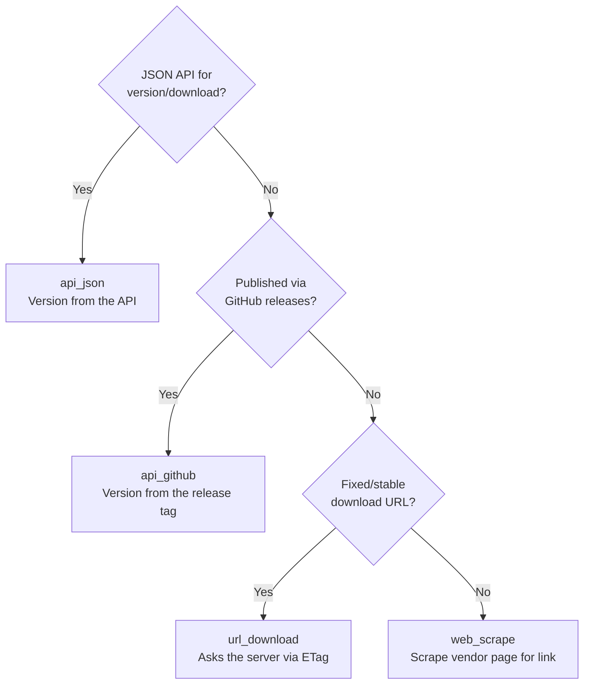
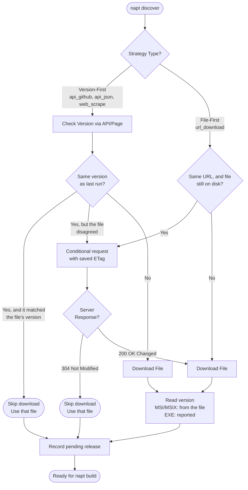

# User guide

## How NAPT works

### Discovery process (`napt discover`)

1. **Load configuration** - Merges code defaults, org, vendor, parent, and
   recipe (see [Configuration layers](#configuration-layers)).
2. **Check version** - Uses the configured discovery strategy to check for new
   versions.
3. **Skip or download**:
    - If the strategy reports the same version as last run and the
      installer's own version agreed (see
      [The installer's version is the version](#the-installers-version-is-the-version)),
      or, for `url_download`, the server answers `304 Not Modified`: skip the
      download.
    - Otherwise: download the installer.
4. **Read the version** - Takes the version from the installer itself (MSI
   ProductVersion, MSIX Identity), falling back to the version the strategy
   reported for installers that carry none (EXE).
   This is the version recorded and used everywhere after.
5. **Record pending release** - Updates `state/deployment/{app_id}.json` with
   the discovered release as the pending publication candidate when its
   installer (by SHA-256) differs from the published one.
   The pending slot holds one candidate and the newest discovery wins.

**Output**: Downloaded installer in `downloads/{app_id}/{version}/`, updated
deployment state.

**One folder per version**: Each download is filed under its version, the same
way builds and packages are.
A vendor that serves every release under one filename (Chrome's
`googlechromestandaloneenterprise64.msi`, for example) therefore cannot
overwrite an installer that is still waiting for approval.

**Saved filename**: The file is saved under the name the server announces, or
the URL's filename when it announces none.
NAPT keeps only the final part of that name, removes characters Windows
forbids in filenames (including `"`), and replaces `$`, `;`, backticks,
single quotes, and typographic quotes with `_`, because
`{{installer_filename}}` is substituted into your install script.
A warning shows the original and saved names when they differ.
Always put `{{installer_filename}}` inside quotes: unquoted, PowerShell runs
parentheses in a filename as code, and those are too common in real names to
replace.

**Version**: The version becomes a folder name
(`downloads/{app_id}/{version}/`), so it may contain only letters, digits, `.`,
`-`, `_`, and `+`.
It must also start with a digit: a device compares versions by each part's
leading digits, so `v2.0` would read as version 0 there, every device would
report it installed, and none would upgrade to it.
If discovery stops with "cannot be used as a folder name" or "does not start
with a number", tighten the recipe's `version_pattern` so it captures only the
version.
An MSI or MSIX is judged by its own version, so this only comes up for EXE
recipes whose pattern (or `api_json` value) keeps a prefix.

### Build process (`napt build`)

1. **Load configuration** - Merges code defaults, org, vendor, parent, and
   recipe (see [Configuration layers](#configuration-layers)).
2. **Find installer** - Reads the release to build from
   `state/deployment/{app_id}.json` (the pending release, or the published
   one when nothing is pending), looks in `downloads/{app_id}/{version}/`, and
   takes the file whose SHA-256 matches the recorded hash.
   A file that changed since discovery is refused.
   With no recorded release (a `--stateless` discover and no state), the
   single installer found in a version folder (`downloads/{app_id}/{version}/`)
   is used; more than one stops the build, and a file placed directly in
   `downloads/{app_id}/` is not found.
3. **Confirm version** - The version is the name of the download folder.
   For an MSI or MSIX, build reads the installer's own version and refuses to
   continue if it differs from the folder, since that means a file was moved
   by hand.
4. **Get PSADT release** - Downloads PSADT Template_v4 from GitHub into
   `cache/psadt/{version}/` if not already cached.
5. **Create build directory** - Creates `builds/{app_id}/{version}/`.
6. **Copy PSADT template** - Copies the cached template into `packagefiles/`
   unchanged (see [Directory structure](#directory-structure)).
7. **Generate deployment script** - Generates `Invoke-AppDeployToolkit.ps1`
   from the template:
    - Writes the `$adtSession` values from `psadt.app_vars` (set `AppName`,
      `AppVendor`, and `AppVersion: "{{discovered_version}}"` there), plus
      `AppScriptDate`, the PSADT version, and `AppArch` (the installer's
      architecture).
    - Inserts `psadt.install` and `psadt.uninstall`.
      For MSI and MSIX they are generated from the installer unless
      overridden
      ([override_msi_commands](recipe-reference.md#override_msi_commands),
      [override_msix_commands](recipe-reference.md#override_msix_commands));
      EXE recipes must supply both.
    - Preserves PSADT's structure and comments.
8. **Copy installer** - Copies the downloaded installer to `Files/`:
    - Source: `downloads/{app_id}/{version}/{installer_filename}`
    - Destination: `builds/{app_id}/{version}/packagefiles/Files/{installer_filename}`
    - Scripts reach it through `$($adtSession.DirFiles)` (PSADT 4.x).
9. **Apply branding** - Replaces PSADT default assets with custom branding
   (if configured):
    - Reads `psadt.brand_pack` (usually set in `org.yaml`; a relative path
      resolves against `defaults/`).
    - Replaces files in `Assets/` (AppIcon.png, Banner.Classic.png, and so
      on).
    - Uses pattern matching to find source files in the brand pack directory.
10. **Generate detection and requirements scripts** - Detection is always
    generated; requirements only when `build_types` is `both` or
    `update_only`.
    See [Detection and requirements scripts](#detection-and-requirements-scripts).

**Output**: PSADT package in `builds/{app_id}/{version}/` with the detection
script, and the requirements script when `build_types` is `both` or
`update_only`.

#### Detection and requirements scripts

NAPT generates PowerShell scripts that Intune Win32 app entries use to check
installation state:

- **Detection script** (always): `{AppName}_{Version}-Detection.ps1`, used by
  the install entry and the update entry.
- **Requirements script** (when `build_types` is `both` or `update_only`):
  `{AppName}_{Version}-Requirements.ps1`, used by the update entry.

For MSI and EXE installers, both scripts share the same logic for registry
lookup, app name resolution, and installer-type filtering; they differ only in
how they interpret the version comparison (see below).
For MSIX installers, scripts query the AppX package database by identity name
instead of scanning the registry; which store is queried depends on
`intune.run_as_account` (see below).

**How the scripts work:**

- **Registry locations checked (architecture-aware):**
    - Scripts use an explicit `RegistryView` (Registry64 or Registry32), so
      the result does not depend on the PowerShell process bitness.
    - **For x64/arm64 architecture** (or the 64-bit view when architecture is
      `any`):
        - `HKLM:\SOFTWARE\Microsoft\Windows\CurrentVersion\Uninstall` (machine-level)
        - `HKCU:\SOFTWARE\Microsoft\Windows\CurrentVersion\Uninstall` (user-level)
    - **For x86 architecture** (or the 32-bit view when architecture is `any`
      on a 64-bit OS):
        - `HKLM:\SOFTWARE\WOW6432Node\Microsoft\Windows\CurrentVersion\Uninstall` (machine-level)
        - `HKCU:\SOFTWARE\Wow6432Node\Microsoft\Windows\CurrentVersion\Uninstall` (user-level)
    - **For x86 architecture on a 32-bit OS**:
        - `HKLM:\SOFTWARE\Microsoft\Windows\CurrentVersion\Uninstall` (machine-level)
        - `HKCU:\SOFTWARE\Microsoft\Windows\CurrentVersion\Uninstall` (user-level)
    - **When architecture is `any`**: checks both 64-bit and 32-bit views
      (all applicable paths above).

- **App name determination:**
    - **MSI installers:** Uses the MSI `ProductName` property (the source of
      the registry `DisplayName`).
      For MSIs whose ProductName includes the version (for example
      "7-Zip 25.01"), set `intune.detection.override_msi_display_name: true`
      and a custom `display_name` pattern.
      See [detection](recipe-reference.md#detection).
    - **EXE installers:** Require `intune.detection.display_name`.
      Scripts match the registry `DisplayName` to this value.

- **Installer type filtering:**
    - **MSI installers (strict):** Match only MSI-based registry entries
      (`WindowsInstaller` = 1), which prevents false matches when both MSI
      and EXE versions exist.
    - **EXE installers (permissive):** Match any registry entry (MSI or not),
      to handle EXE installers that run an embedded MSI.

- **Architecture filtering:**
    - Controls which registry views are checked, based on the installer
      architecture NAPT resolves at build time (NAPT sets `AppArch` in the
      generated script; it is not a recipe `app_vars` key).
    - **MSI installers:** Architecture is read from the MSI package metadata.
    - **EXE installers:** Architecture must be set in `intune.detection`
      (for example `architecture: "x64"`); there is no default, and build
      stops without it.
    - **Architecture values:**
        - `x64` / `arm64`: checks only the 64-bit registry view (ARM64 uses
          the 64-bit registry).
        - `x86`: checks only the 32-bit registry view.
        - `any`: checks both 64-bit and 32-bit views.
          An allowed value for EXE recipes, and what a neutral MSIX
          resolves to.
    - Prevents false matches when both 32-bit and 64-bit versions of the same
      software are installed.

- **MSIX detection (AppX package-based):**
    - MSIX installers query the Windows AppX package database by package
      identity name (from `AppxManifest.xml`), not the registry.
    - Which store is queried depends on `intune.run_as_account`:
        - `"system"` (default): `Get-AppxProvisionedPackage -Online`
          (provisioned, all-users store)
        - `"user"`: `Get-AppxPackage -Name` (per-user store)
    - Architecture is read from the manifest's `ProcessorArchitecture`
      attribute.
    - The `intune.detection.display_name`, `architecture`, and
      `override_msi_display_name` fields are not used for MSIX installers.

- **Logging:**
    - **Format:** CMTrace, for compatibility with Intune diagnostics tools.
    - **Primary location** (both contexts):
      `C:\ProgramData\Microsoft\IntuneManagementExtension\Logs\`
        - Detection: `NAPTDetections.log` (system) / `NAPTDetectionsUser.log` (user)
        - Requirements: `NAPTRequirements.log` (system) / `NAPTRequirementsUser.log` (user)
    - **Fallback locations** (used if the primary location fails):
        - System context: `C:\ProgramData\NAPT\`
        - User context: `%LOCALAPPDATA%\NAPT\`
        - Same log file names as the primary locations
    - **Fallback behavior:** The script tries the primary location first
      (creating the directory if needed and verifying write access).
      If that fails, it tries the fallback.
      If both fail, the script continues with a warning to stderr and no log
      file.
    - **Log rotation:** Two files (`.log` and `.log.old`), 3MB maximum per
      file by default.

**Detection and requirements scripts compared:**

- **Detection script** - Checks whether the application is installed at the
  expected version:
    - Match modes: exact match (installed = expected) or minimum version
      (installed >= expected).
    - Exit codes: exits 0 and writes `Installed` to stdout when detected;
      exits 1 otherwise.
- **Requirements script** - Determines whether an installed application needs
  the update:
    - Version check: installed version < target version.
    - Output: writes `Required` to stdout if the update is needed, nothing
      otherwise.
    - Exit codes: always exits 0 (Intune evaluates stdout).
    - Intune configuration: requirement rule with output type String,
      operator Equals, value `Required`.

**Output location and packaging:**

Scripts are saved as siblings to the `packagefiles/` directory and are not
included in the `.intunewin` package:

```
builds/napt-chrome/144.0.7559.110/
  ├── packagefiles/                                 # PSADT package (packaged into .intunewin)
  │   └── ...
  ├── Google-Chrome_144.0.7559.110-Detection.ps1    # Detection script
  ├── Google-Chrome_144.0.7559.110-Requirements.ps1 # Requirements script (if generated)
  └── build-manifest.json                           # Installer hash and metadata
```

**Configuration:** See
[Intune configuration](recipe-reference.md#intune-configuration) for the
`intune.detection` and `intune.build_types` options.

### App icons

During `napt build`, NAPT extracts the app's icon from the installer and
saves it to `{directories.icons}/{id}.png` (default `icons/`).
`napt upload` sends that file as the app's logo in Intune and the Company
Portal.

Extraction sources per installer type:

- **MSI** - The Icon table (preferring the row named by `ARPPRODUCTICON`).
  If the MSI has no usable Icon table entry, NAPT performs an
  administrative extract (`msiexec /a`) and scans the contained
  executables for icons
- **EXE** - The executable's own icon resources
- **MSIX** - Logo assets declared in `AppxManifest.xml`, including scale
  and targetsize variants

Extraction rules:

- Only icon frames that are already PNG-encoded are used; NAPT does not
  re-encode or upscale images
- Frames must be at least 128px wide and at most 700KB (Intune rejects
  icons over 750KB)
- Among qualifying frames, the one closest to Intune's recommended 256px
  is selected
- If no qualifying frame exists, the build prints a warning and continues
  without an icon.
  The failure is recorded in an `icons/{id}.no-icon` marker so expensive
  MSI extraction is not repeated on every build; the marker invalidates
  itself when the installer changes

Like `downloads/` and `builds/`, the icons directory is a machine-local
output directory (add it to `.gitignore` with them); each machine extracts
its own icons at build time, and NAPT never overwrites an existing icon file.

Icon resolution order at upload: `intune.logo_path` (if set), then
`icons/{id}.png`, then no icon with a warning.
To replace or pin an icon, see
[Set a custom app icon](common-tasks.md#set-a-custom-app-icon).

### Package process (`napt package`)

1. **Resolve build directory** - Scans `builds/{app_id}/` for the most recently
   modified version directory that contains a `packagefiles/` folder.
   Use `--version VERSION` to target a specific version instead.
2. **Verify structure** - Checks that the build directory has the required
   PSADT structure:
    - `PSAppDeployToolkit/` directory
    - `Files/` directory
    - `Invoke-AppDeployToolkit.ps1` script
    - `Invoke-AppDeployToolkit.exe` launcher
3. **Get IntuneWinAppUtil** - Downloads `IntuneWinAppUtil.exe` from
   Microsoft's GitHub repository if not already cached.
   The release is controlled by `intunewin.release` in `defaults/org.yaml`
   (default: `"latest"`).
   The tool is cached under `cache/tools/{version}/`, so each pinned release
   is stored independently.
4. **Create package** - Runs `IntuneWinAppUtil.exe` to create the
   `.intunewin` file:
    - Input: the build's `packagefiles/` subdirectory (PSADT structure)
    - Output: `Invoke-AppDeployToolkit.intunewin` in
      `packages/{app_id}/{version}/`
    - Only one version is kept on disk per app: the previous version's
      package folder is removed first, so a failed run leaves no package;
      re-run `napt package`.
5. **Copy detection scripts** - Copies `*-Detection.ps1`,
   `*-Requirements.ps1`, and `build-manifest.json` from the build version
   directory into `packages/{app_id}/{version}/`, so `napt upload` does not
   need the builds directory.
6. **Optional cleanup** - With `--clean-source`, removes the build version
   directory after successful packaging.

**Output**: `.intunewin` and detection scripts in
`packages/{app_id}/{version}/`, ready for `napt upload`.

### Upload process (`napt upload`)

Run `napt package` first.

1. **Locate package** - Scans `packages/{app_id}/` (`directories.package`)
   for the versioned subdirectory created by `napt package` and reads
   `Invoke-AppDeployToolkit.intunewin` from it.
   Verifies the package's installer hash (from the build manifest) against the
   pending release in the app's deployment state; a mismatch aborts the upload,
   so what was recorded at discovery is byte-for-byte what ships.
   When no pending release is recorded, the upload proceeds with a warning,
   or fails when `deployment.require_pending` is enabled.
2. **Authenticate** - Uses the CI/CD environment credential or the session
   from `napt auth login` (see [Authentication](#authentication) below).
3. **Parse package metadata** - Reads encryption metadata from `Detection.xml`
   inside the `.intunewin` ZIP.
4. **Create, upload, commit (install entry)** (steps 4 to 6) - Creates the
   Win32 app record using the base app name and detection script only,
   uploads the encrypted payload to Azure Blob Storage, and commits the
   content version.
   Skipped when `build_types` is `"update_only"`.
5. **Create, upload, commit (update entry)** (steps 7 to 9, or 4 to 6 with
   `update_only`) - Creates a
   second Win32 app record using `update_name_prefix + name` and the
   detection and requirements scripts, uploads the same encrypted payload,
   and commits.
   Skipped when `build_types` is `"app_only"`.
   When `build_types` is `"both"` (default), this runs after the install entry
   is fully committed.

Each created app entry carries a provenance stamp in its Intune notes field:
`napt/v1 id=<recipe-id> entry=<install|update> sha256=<installer-hash>`.
The stamp marks the app as NAPT-managed and ties it to the exact binary it was
built from; the notes field is reserved for NAPT and is not recipe-configurable.
On success, the app's deployment state records the published version, hash,
and Intune app IDs (null for an entry not created), and a matching pending
slot is cleared.

Re-running an upload is safe.
Before creating anything, NAPT lists the tenant's apps and looks for stamps
matching this release: a fully published match is adopted as-is, a match whose
content was never committed (a crashed previous run) is deleted and recreated
(it gets a new app ID), since Intune refuses new content on an app whose first
content was never committed, and only missing entries are created.
Apps without a NAPT stamp are never touched.

Adoption keeps the matched app exactly as it is: it does not re-send
metadata or package content, since the match key is the installer binary.
If you changed the recipe or package without a new installer release
(PSADT commands, detection settings, icon), pass `--force` to update the
matched apps' metadata and upload a fresh content version.
`--force` never creates duplicates.
With `deployment.require_pending: true`, upload refuses a package that has no
pending release, and republishing the already-published binary has none; add
a `pending` entry (the published release's `version`, `sha256`, and `url`) to
`state/deployment/<app_id>.json` by hand first.

**Output**: Intune Win32 App ID (install entry), Intune Win32 Update ID (update
entry), app name, version, and package path.
Each ID is omitted when its entry is not created.

#### Authentication

`napt upload`, `napt promote apply`, and
`napt promote plan --reconcile`/`--check-drift` all need a Microsoft Graph
token.
NAPT resolves it the same way every time; `napt auth status` shows which
source it picked:

| Method | When it's used |
|--------|---------------|
| Service principal (`EnvironmentCredential`) | `AZURE_CLIENT_ID`, `AZURE_TENANT_ID`, and `AZURE_CLIENT_SECRET` (or `AZURE_CLIENT_CERTIFICATE_PATH`) are set (CI/CD) |
| Interactive session (`napt auth login`) | Nothing above is set and you have signed in on this machine (developers) |
| Azure CLI (`AzureCliCredential`) | Nothing above applies and the Azure CLI is signed in as a service principal (CI/CD with OIDC through a login step such as GitHub Actions `azure/login`). A CLI signed in as a person is refused, since its tokens belong to the Azure CLI's own application, not the NAPT registration |

NAPT never opens a browser on its own.
If no credential is available, commands fail with `Not authenticated.`
followed by a hint for each option: run `napt auth login` interactively, or
set the `AZURE_*` variables or sign in with `az login` for CI/CD.

#### App registration setup

Create the app registration once per organization.

**Manual (Entra portal):**

1. Go to [entra.microsoft.com](https://entra.microsoft.com) →
   **App registrations** → **New registration**
2. Name it (e.g. "NAPT"), leave redirect URI blank, click **Register**
3. Note the **Application (client) ID** and **Directory (tenant) ID**
4. Go to **API permissions** → **Add a permission** →
   **Microsoft Graph** → **Application permissions** → add
   `DeviceManagementApps.ReadWrite.All` and `Group.Read.All`
   (used by CI/CD; `Group.Read.All` resolves Entra ID group names in
   `deployment:` configuration to object IDs)
5. Repeat for **Delegated permissions** → add the same two
   (used by interactive sign-in)
6. Click **Grant admin consent**
7. Go to **Authentication** → **Add a platform** →
   **Mobile and desktop applications** and add these redirect URIs:
    - `http://localhost` (browser sign-in)
    - `ms-appx-web://Microsoft.AAD.BrokerPlugin/<Application (client) ID>`
      (Windows broker sign-in)

**Automatic (`napt auth setup`):**

```bash
napt auth setup --tenant-id "<Directory (tenant) ID>"
```

Signs you in through the browser as an account holding the
**Application Administrator** role (or higher) and does
everything in the manual list through Microsoft Graph: creates the
registration (or finds one named `NAPT`; use `--name` or `--client-id` to
target another), adds the redirect URIs and the application + delegated
permissions, creates the service principal, and grants admin consent.
It then remembers the tenant and client ID, so the next sign-in needs only
`napt auth login`.

The registration is stamped in its **Internal notes** (Branding &
properties) with a provenance line such as
`napt/v1 spec=1 version=0.10.0 provisioned=2026-08-18`; any notes an
administrator adds below it are preserved.
Re-running is safe: NAPT compares the registration against what the
installed version needs and adds only what is missing.
After upgrading NAPT, re-run `napt auth setup` to add any new permission.
A registration that matches by name but carries no stamp (one made in the
portal, for example) is not touched until you pass `--adopt`, which adds
NAPT's redirect URIs, Graph permissions, and admin consent to it and
stamps it; nothing existing is ever removed.
Naming the registration explicitly with `--client-id` counts as that
consent.

Add `--federated-issuer` and `--federated-subject` to also create the
federated credential for OIDC CI/CD (below) in the same
run; the values come from your CI platform's OIDC documentation.
`--federated-audience` (default `api://AzureADTokenExchange`) and
`--federated-name` (default derived from the subject) override the
credential's audience and name.
The administrator sign-in uses the Microsoft Graph Command Line Tools app
(the same one `Connect-MgGraph` uses); NAPT does not store that account or
its tokens, though your browser may keep its own sign-in.
If your tenant blocks that app, `--print-only` prints the portal checklist
with the exact values for someone to click through instead.

**Developer setup:**

Sign in once; the client and tenant IDs are remembered for later logins:

```bash
napt auth login --tenant-id "<Directory (tenant) ID>" --client-id "<Application (client) ID>"
```

On Windows this opens the OS account picker (Web Account Manager),
signing you in with your work account, honoring device-based Conditional
Access, and keeping the refresh token device-bound.
Elsewhere, or with `--no-broker`, it opens your browser.
The broker needs an interactive Windows session: from a scheduled task,
service, `runas`, or SSH session, use a service principal or OIDC instead.
Tokens are cached in the OS credential store (DPAPI, Keychain, or
libsecret) and refreshed silently until the session expires or is revoked.
The remembered tenants and the cache live under `%LOCALAPPDATA%\napt`
(Windows), `~/Library/Application Support/napt` (macOS), or
`$XDG_CONFIG_HOME/napt` falling back to `~/.config/napt` (Linux); set
`NAPT_USER_DIR` to relocate them.
The `AZURE_*` environment variables play no part in interactive sign-in;
they are how CI/CD supplies a credential (below), and when they are set
they take precedence over your session.

Check what you are holding at any time:

```console
$ napt auth status
Method:      interactive (broker)
Account:     admin@contoso.com
Tenant:      00000000-0000-0000-0000-000000000000
Client ID:   11111111-1111-1111-1111-111111111111
Expires:     2026-08-16T19:04:11+00:00
Permissions: DeviceManagementApps.ReadWrite.All, Group.Read.All

Known tenants:
  * Contoso (contoso.com)
      Account:   admin@contoso.com
      Tenant ID: 00000000-0000-0000-0000-000000000000
      Client ID: 11111111-1111-1111-1111-111111111111
    Contoso Dev (contosodev.onmicrosoft.com)
      Account:   (signed out)
      Tenant ID: 22222222-2222-2222-2222-222222222222
      Client ID: 33333333-3333-3333-3333-333333333333
  (* = active; switch with 'napt auth login --tenant-id <id or domain>')
```

The tenant's default domain and display name are looked up once at login
through the delegated `User.Read` permission, which new app registrations
carry by default.
Without it the tenant is listed as `(name unknown)`; sign-in itself is
unaffected.
`napt auth status` exits 1 when no credential is available or a required
permission is missing, and names the missing permission.
`napt auth logout` signs out of the active tenant (`--all` for every tenant);
the IDs stay remembered.

**Multiple tenants:**

Sign in to each tenant once with its own client ID.
NAPT remembers every tenant you have signed in to and which one is active;
`napt auth status` lists them.
Switch by passing only the tenant ID (or its default domain, once known),
with no prompt as long as that tenant's session is still valid:

```bash
napt auth login --tenant-id "<prod tenant ID>" --client-id "<prod client ID>"   # first time
napt auth login --tenant-id contosodev.onmicrosoft.com                           # switch back, silent
```

**CI/CD setup, OIDC federation (recommended):**

No secret to store or rotate.
Create a federated credential on the app registration that trusts your CI
platform's OIDC issuer for the workflow that runs NAPT.
Scope it to a deployment environment rather than a branch, so only the
jobs that declare that environment (the ones that touch Intune) can
obtain tokens; merges to `main` stay gated by your branch protection and
PR review as usual.
For GitHub Actions and an environment named `intune`:

```bash
napt auth setup --tenant-id "<Directory (tenant) ID>" \
  --federated-issuer https://token.actions.githubusercontent.com \
  --federated-subject "repo:owner@<owner id>/name@<repository id>:environment:intune"
```

Use the subject your repository actually emits.
GitHub's immutable format above embeds the owner and repository IDs so a
renamed or recreated repository cannot inherit the trust; repositories
created or renamed after 2026-07-15 emit it by default, older ones until
opted in emit `repo:owner/name:environment:intune`.
See
[Migrate GitHub Actions federated credentials to immutable subjects](https://learn.microsoft.com/en-us/entra/workload-id/workload-identities-github-immutable-subjects)
and GitHub's OIDC reference for the IDs and the opt-in.
Other platforms use their own subject format (see their OIDC
documentation); by hand, the same values go under **Certificates & secrets**
→ **Federated credentials** → **Add credential** → **Other issuer**.
Then sign in with `azure/login` before NAPT runs:

```yaml
permissions:
  id-token: write
  contents: read

jobs:
  upload:
    runs-on: ubuntu-latest
    environment: intune
    steps:
      - uses: azure/login@v2
        with:
          client-id: ${{ secrets.AZURE_CLIENT_ID }}
          tenant-id: ${{ secrets.AZURE_TENANT_ID }}
          allow-no-subscriptions: true
      - run: napt upload recipes/Google/chrome.yaml
```

`azure/login` exchanges the workflow's OIDC token for an Azure CLI session;
NAPT then obtains its Graph token from that session (`AzureCliCredential`),
so the job needs no `AZURE_*` variables at all.

**CI/CD setup, client secret:**

Create a client secret under **Certificates & secrets** → **New client secret**.
Set all three environment variables as pipeline secrets:

```bash
AZURE_CLIENT_ID="<Application (client) ID>"
AZURE_CLIENT_SECRET="<client secret value>"
AZURE_TENANT_ID="<Directory (tenant) ID>"
```

A certificate works the same way with `AZURE_CLIENT_CERTIFICATE_PATH`
instead of `AZURE_CLIENT_SECRET`.

### Directory structure

After a complete workflow, the project holds:

```
cache/
  ├── psadt/
  │   └── 4.1.7/                           # PSADT template, downloaded by napt build
  └── tools/
      └── <version>/                       # IntuneWinAppUtil.exe, downloaded by napt package

icons/
  └── napt-chrome.png                      # Extracted by napt build, read by napt upload

downloads/
  └── napt-chrome/
      ├── .download.json                   # What the last discover run resolved
      └── 142.0.7444.163/
          └── googlechromestandaloneenterprise64.msi

builds/
  └── napt-chrome/
      └── 142.0.7444.163/
          ├── packagefiles/                # PSADT package contents
          │   ├── PSAppDeployToolkit/      # PSADT module (from template)
          │   ├── PSAppDeployToolkit.Extensions/
          │   ├── Assets/                  # Custom branding (if configured)
          │   ├── Config/
          │   ├── Strings/
          │   ├── Files/                   # Installer copied here
          │   │   └── googlechromestandaloneenterprise64.msi
          │   ├── SupportFiles/            # Empty (for additional files)
          │   ├── Invoke-AppDeployToolkit.ps1  # Generated script
          │   └── Invoke-AppDeployToolkit.exe  # From template
          ├── Google-Chrome_142.0.7444.163-Detection.ps1
          ├── Google-Chrome_142.0.7444.163-Requirements.ps1
          └── build-manifest.json              # Installer hash and metadata

packages/
  └── napt-chrome/
      └── 142.0.7444.163/                              # One version kept at a time
          ├── Invoke-AppDeployToolkit.intunewin        # Encrypted package
          ├── Google-Chrome_142.0.7444.163-Detection.ps1    # Copied by napt package
          ├── Google-Chrome_142.0.7444.163-Requirements.ps1 # Copied by napt package
          └── build-manifest.json                      # Copied by napt package; read by napt upload

state/
  ├── deployment/
  │   └── napt-chrome.json                 # Deployment state (authoritative)
  └── plans/
      └── napt-chrome.json                 # Promotion plan, written by napt promote plan
```

## Commands reference

> **Tip:** All commands support `--help` (or `-h`) for detailed usage,
> options, and examples.

### napt init

Initializes a new NAPT project.
Creates `recipes/`, `defaults/org.yaml`, `defaults/vendors/`, and
`state/deployment/`.
Existing files are preserved by default; use `--force` to back up and
overwrite.

```bash
napt init [DIRECTORY] [OPTIONS]
```

### napt validate

Validates recipe syntax and configuration without making network calls.
Checks YAML syntax, required fields, and strategy configuration.
It checks the recipe and its parent only: errors in `defaults/org.yaml` or
vendor files, and build-time requirements such as the EXE
`intune.detection` fields, surface at `napt discover` or `napt build`.
It does not check that URLs are reachable or files can be downloaded.

```bash
napt validate recipes/Google/chrome.yaml [OPTIONS]
```

### napt discover

Discovers the latest version and downloads the installer, skipping the
download when the installer has not changed.
See [Discovery process](#discovery-process-napt-discover) and
[Skipping downloads](#skipping-downloads).

```bash
napt discover recipes/Google/chrome.yaml [OPTIONS]
```

### napt build

Builds a PSADT package from a recipe and the downloaded installer.
See [Build process](#build-process-napt-build).

```bash
napt build recipes/Google/chrome.yaml [OPTIONS]
```

### napt package

Creates a `.intunewin` package for a recipe's build.
Without `--version`, packages the most recently modified build.
See [Package process](#package-process-napt-package).

```bash
napt package recipes/Google/chrome.yaml [OPTIONS]
napt package recipes/Google/chrome.yaml --version 130.0.6723.116
```

### napt promote

Plans and applies ring-based promotion of published apps.
`promote plan` computes which releases are ready to move through the
deployment rings (per `deployment.rings`) and writes one plan file per app
with work (see [Promotion plan files](#promotion-plan-files)).
It is read-only unless `--reconcile` is passed.

`promote apply` executes the plans against Intune: assigns install
entries, promotes releases through rings, unassigns displaced releases,
and retires them per `deployment.retain_versions`.
It consumes only the plan files of the recipes it was given; a recipe
without a plan file has nothing to apply, and plan files for other apps are
left untouched.
Once the plan files are loaded, each app is an independent unit: one app's
failure, whether a Graph error, an unresolvable group, or a state file that
cannot be written, keeps its plan file for retry and never blocks the others.
A plan file that cannot be loaded (corrupt, reshaped, or misnamed) stops the
whole run before any app is applied.
Stale or already-applied actions are skipped with a warning, so re-running
after a partial failure is safe.
Assignments NAPT does not manage (admin-made groups, all-device targets,
exclusions) are always preserved.

Both commands report **assignment drift**: every discrepancy between what
deployment state says should be assigned and what Intune actually has.
That covers removed or changed NAPT assignments, unrecorded or foreign
assignments on NAPT-managed apps, releases missing from the tenant, stamped
apps no state file references, and stamped apps with no recipe.
Drift is checked against the recipes in the run, so a single-recipe run
reports every other app's NAPT entries as having no recipe; run drift over
the whole recipes directory.
An assignment NAPT has no record of making is classified by evidence: one
that matches a currently configured target is reported as *unrecorded* (a
lost apply writeback, which a later apply converges, or an admin pre-empting
configured policy), while one matching no configured target is reported as
*unexpected* (typically admin-made).
Drift is warned about and never corrected.
Apply checks automatically; plan checks with `--check-drift` (which needs
Graph credentials; without the flag, plan stays fully offline).

Both commands also **validate plan groups**.
Authenticated plan runs (`--check-drift` or `--reconcile`) resolve every
group named in the computed plan and fail, writing no plan files, when one
does not resolve, so a plan with a group typo never becomes a reviewable
promotion PR.
Apply preflights each app's actions the same way before executing any of
them, so an unresolvable group fails that app with zero tenant mutations
instead of stranding a half-applied plan; fix the configuration and re-plan.
A dead group referenced only by stale or already-applied actions never
blocks an app, so re-running after a partial failure stays safe.
Offline plans skip validation (warning when they produce actions), and the
apply preflight backstops whatever they produce.

Both commands also recover **lost publication writebacks**: when an upload
succeeded but the state commit recording it never landed (a CI push rejected
by branch protection, a crashed runner), the tenant holds a fully published
release that state still lists as pending.
Recovery re-derives the published record from the same provenance-stamp
evidence idempotent upload uses, and only when every entry of the release
has committed content; a partially published release is warned about
instead, since only a publish re-run can finish it.
Apply reconciles automatically; plan reconciles with `--reconcile` (which
needs Graph credentials and, unlike the rest of plan, writes deployment
state).
In `plan --reconcile`, reconciliation runs before planning, so a recovered
release is promotable in the same run; in apply, the plan files were
computed earlier, so a recovered release waits for the next plan run.

```bash
napt promote plan [RECIPE_OR_DIR] [OPTIONS]
napt promote plan --check-drift --reconcile
napt promote apply [RECIPE_OR_DIR] [OPTIONS]
napt promote apply --plan-file state/plans/<id>.json
```

For the full review-gated CI setup (publish PRs, promotion PRs, and
writeback commits) see
[Automate NAPT with GitHub Actions](common-tasks.md#automate-napt-with-github-actions).

### napt status

Shows deployment state across all apps: published version, pending
release, and which version holds each ring.
`--format json` for scripting.

```bash
napt status [OPTIONS]
```

A pending release whose version is lower than the published one is marked
`[DOWNGRADE]` in the table and `"pending_is_downgrade": true` in the JSON.
See [Downgrades](#downgrades).

### napt upload

Uploads the `.intunewin` package to Microsoft Intune via the Graph API.
Uses the CI/CD environment credential when set, otherwise the session from
`napt auth login`.

```bash
napt upload recipes/Google/chrome.yaml [OPTIONS]
```

### napt auth

Manages the credential NAPT uses for Intune.
See [Authentication](#authentication).

```bash
napt auth setup --tenant-id ID [OPTIONS]
napt auth login [--tenant-id ID] [--client-id ID] [--no-broker]
napt auth status
napt auth logout [--all]
```

### Output modes

| Flag | What it shows |
|------|---------------|
| (none) | Clean output with step indicators (e.g., `[1/4]`) and progress |
| `--verbose` or `-v` | All of the above, plus HTTP requests/responses, file operations, SHA-256 hashes, and configuration loading |
| `--debug` or `-d` | All verbose output, plus full YAML config dumps (org/vendor/recipe/merged), backend selection details, and raw API responses |

Use `--verbose` for normal troubleshooting and `--debug` when you need to see
exactly what NAPT is doing internally.

## Discovery strategies

### Available strategies

| Strategy | Version source | Use case | How "unchanged" is detected |
|----------|---------------|----------|-----------------------------|
| **api_github** | Latest release tag | GitHub-hosted releases | Same version as last run (and the file agreed) |
| **api_json** | JSON API | REST APIs with metadata | Same version as last run (and the file agreed) |
| **url_download** | File metadata | Fixed URLs, MSI or MSIX installers | HTTP conditional request (ETag) |
| **web_scrape** | Download page | Vendors without APIs | Same version as last run (and the file agreed) |

> **Note:** For configuration examples and field documentation for each
> strategy, see [Recipe Reference](recipe-reference.md).

### Decision guide


```mermaid
flowchart TD
    Start{JSON API for<br/>version/download?}
    Start -->|Yes| JSON[api_json<br/>Version from the API]
    Start -->|No| GitHub{Published via<br/>GitHub releases?}
    GitHub -->|Yes| GHRelease[api_github<br/>Version from the release tag]
    GitHub -->|No| DirectURL{Fixed/stable<br/>download URL?}
    DirectURL -->|Yes| Static[url_download<br/>Asks the server via ETag]
    DirectURL -->|No| Scrape[web_scrape<br/>Scrape vendor page for link]
```

## Recipe basics

A recipe is a YAML file that says how to discover, download, and package one
application: a discovery strategy, PSADT scripts and variables, and optional
Intune settings.
Every field is documented in the [Recipe Reference](recipe-reference.md);
worked examples for each strategy are in [Common Tasks](common-tasks.md).

## State management & downloads

NAPT keeps files in two places:

- **The downloads folder** (`downloads/<app_id>/<version>/`) - The installers
  themselves.
  Disposable: deleting it costs one full re-download per app, unless the
  vendor no longer serves a pending release's installer (see
  [Automate NAPT with GitHub Actions](common-tasks.md#automate-napt-with-github-actions)
  for why the installer cache steps matter).
  Safe to gitignore.
- **Deployment state** (`state/deployment/<app_id>.json`) - The authoritative
  per-app record of what NAPT has published to Intune (`published`) and what
  is awaiting publication (`pending`).
  Not regenerable.
  Written deterministically (fixed reading-order keys, no write-time
  timestamps), so unchanged state produces byte-identical files and clean
  diffs.
  Commit these files to version control if you want an auditable record or a
  PR-based review workflow.

### Skipping downloads

`napt discover` avoids downloading an installer it already has, which matters
most for CI/CD running frequent scheduled checks.
The downloads folder is the only thing it consults, so restoring that folder
between runs (for example with `actions/cache`) is all a pipeline needs to do.

How the check works depends on the discovery strategy:


```mermaid
flowchart TD
    Start([napt discover]) --> Strategy{Strategy Type?}

    Strategy -->|Version-First<br/>api_github, api_json, web_scrape| CheckVersion[Check Version via API/Page]
    Strategy -->|File-First<br/>url_download| HaveFile{Same URL, and file<br/>still on disk?}

    CheckVersion --> SameVersion{Same version<br/>as last run?}
    SameVersion -->|Yes, and it matched<br/>the file's version| Skip1([Skip download<br/>Use that file])
    SameVersion -->|Yes, but the file<br/>disagreed| CheckETag
    SameVersion -->|No| Download1[Download File]

    HaveFile -->|Yes| CheckETag[Conditional request<br/>with saved ETag]
    HaveFile -->|No| Download2[Download File]
    CheckETag --> ETagResponse{Server<br/>Response?}
    ETagResponse -->|304 Not Modified| Skip2([Skip download<br/>Use that file])
    ETagResponse -->|200 OK Changed| Download2

    Download1 --> ReadVersion[Read version<br/>MSI/MSIX: from the file<br/>EXE: reported]
    Download2 --> ReadVersion
    ReadVersion --> Pending[Record pending release]
    Skip1 --> Pending
    Skip2 --> Pending
    Pending --> Ready([Ready for napt build])
```

Every download writes `downloads/<app_id>/.download.json`, which records what
that run resolved: the URL, the version the strategy reported, the server's
`ETag` and `Last-Modified`, and the installer's own version, filename, and
hash.
The file is a hint, not a record: if it is missing or unreadable, NAPT
downloads the full file and writes a new one.

**Version-first strategies** (api_github, api_json, web_scrape) learn a
version before downloading.
When it is the same version the last run reported and the installer's own
version agreed (see
[The installer's version is the version](#the-installers-version-is-the-version)),
the installer on disk is reused without a request.

**url_download** cannot know the version without the file, so it asks the
server whether the file changed.
The next run sends the recorded `ETag` (or `Last-Modified` when there is
none) back as a conditional request; a `304 Not Modified` answer reuses the
installer.
The values are only sent while the URL is unchanged and that installer is
still on disk; a changed URL means a full download.

### The installer's version is the version

The version a page or API reports is only the trigger for a download.
Once the file is on disk, an MSI or MSIX installer reports its own version,
and that is what NAPT records: it names the download folder, becomes the
pending release, and later names the build and package folders, fills
`{{discovered_version}}`, and is the version the detection script compares
against on a device.
An EXE carries no readable version, so for it the reported version is used
as is.

When the two differ only in format (`4.41.106` against `4.41.106.0`),
discover notes it in its log and treats them as the same version, because a
device would too.

A real disagreement (the page says 2.1, the file is 2.0) means the vendor is
serving an older file than it advertises, or the recipe's `version_pattern`
captured the wrong value.
The recorded release is truthful either way: 2.0 is what gets recorded.
Discover also stops trusting the page's version as proof that nothing
changed, since it was already wrong about this file once.
Every run logs a warning naming both values and asks the server whether the
file changed, using the saved `ETag`; a `304 Not Modified` reuses the file, a
`200` fetches whatever the server now serves.
A server that sends no `ETag` or `Last-Modified` gets a full download each run
instead.
Once the page's version and the file's agree again, the request-free skip
returns.
If the warning never goes away, the recipe's `version_pattern` is the likely
cause.

**A version that goes down** (a vendor pulling a release) is handled like any
other change: the older version gets its own folder and its own download.
NAPT never relabels an installer it already has.

### Downgrades

NAPT treats a release as new when its installer differs from the published
one, whichever direction the version moved.
When a vendor replaces `2.0.0` with `1.9.0`, `napt discover` records `1.9.0`
as the pending release like any other, and nothing is published until you
approve it.

NAPT labels it:

- `napt discover` logs a warning that the pending release is lower than the
  published one.
- `napt status` marks the app `[DOWNGRADE]` (`"pending_is_downgrade": true`
  in JSON).
- The
  [reference discover workflow](common-tasks.md#workflow-1-discover-opens-publish-prs)
  reads that field and opens the PR as
  `Publish <Name> 1.9.0 (downgrade from 2.0.0)` with a warning at the top of
  the body.

The label is worked out each time from the two versions in deployment state;
it is not stored.

**Publishing a downgrade does not roll devices back** with the default
`intune.detection.exact_match: false`.
Detection and requirements scripts then treat "this version or higher" as
installed, so a device already on `2.0.0` reports the app as installed and is
left alone.
Only new installs receive `1.9.0`.
To move existing devices down, uninstall the newer version first.
With `exact_match: true`, detection tests for the exact version, so a device
on `2.0.0` reports `1.9.0` as not installed and a required install
assignment installs `1.9.0` over it.

**How versions are ordered:** NAPT uses the same comparison as the detection
script on the device, so the label means "devices on the published version
will not take this".
Each `.` or `-` separated part contributes its leading digits, and a part with
no leading digits counts as 0.
A prerelease tag is therefore not ranked (`1.0-rc1` equals `1.0`); capture
only the numeric version in the recipe's `version_pattern`.
A version must also start with a digit (see
[Discovery process](#discovery-process-napt-discover)).

### Deployment state

Each app gets its own file, `state/deployment/<app_id>.json`, so concurrent
changes to different apps never conflict and each file's diff is scoped to
one app.
Every file carries a `schemaVersion` (currently 1); NAPT refuses files
whose schemaVersion is missing or unsupported.
A file names its app once at the top with `app_id` (which must match the
filename; a copied or renamed file is rejected) and the recipe's display
`name` (refreshed on every save), then holds five sections:

- `published` - The release currently in Intune, with its SHA-256 hash and
  Intune app IDs.
  Null until the first upload.
  Publishing uploads the release without assigning it; `napt promote`
  deploys it through the rings afterwards.
- `install_assigned` - The release the install entry is currently assigned
  to (the result of a promotion plan's `assign` action).
- `pending` - The discovered release awaiting publication (version, download
  URL, SHA-256 hash).
  A single slot: a newer discovery replaces an unpublished candidate (newest
  wins), and discovering the already-published release clears it.
  Identity is the SHA-256 hash, so a vendor re-release of the same version
  with a different binary counts as new.
- `rings` - Which version currently holds each deployment ring, with the
  timestamp it entered (written by `napt promote apply`).
- `retained` - Displaced versions kept in Intune for rollback per
  `deployment.retain_versions` (written by `napt promote apply`).

Keys follow reading order (lifecycle order at the top level, `version`
first and hashes last inside blocks) because these files are what a
publish PR diff shows its reviewer.

`napt discover --stateless` neither reads nor writes deployment state, so no
pending release is recorded (useful for one-off checks); installers already
in the downloads folder are still reused.

### Promotion plan files

`napt promote plan` evaluates ring eligibility as a pure function of
deployment state, configuration, and the clock, and writes the result as
one file per app: `state/plans/<app-id>.json`.
A plan file names its app once at the top and lists actions of two
types, one per Intune entry: `promote` moves a release one ring forward
(`from_ring: null` marks a first rollout into the first ring), and
`assign` points new installs at the release.
Every action opens with a plain-English `summary` and carries the
details behind it (the entry touched, the version it displaces, bake
timestamps) so the file diff reads on its own in review:

```json
{
  "schemaVersion": 1,
  "app_id": "napt-chrome",
  "name": "Google Chrome",
  "actions": [
    {
      "summary": "Promote 140.0.7339.128 from pilot to production, displacing 139.0.7258.155; it has held pilot since 2026-07-14 (threshold: 2 days).",
      "type": "promote",
      "entry": "update",
      "version": "140.0.7339.128",
      "displaces": "139.0.7258.155",
      "from_ring": "pilot",
      "from_ring_entered_at": "2026-07-14T07:12:03+00:00",
      "promote_after_days": 2,
      "ring": "production",
      "groups": ["Production Devices"],
      "sha256": "6ff02fd8a4..."
    }
  ]
}
```

An app's plan file exists exactly when that app has eligible actions: a
plan run that finds nothing for an app removes its stale plan file.
Each file's git status is therefore the per-app CI signal that a
promotion review is needed; there are no special exit codes (`napt` exits
0 on success, 1 on error, and 2 on a usage error).
Plan output is deterministic, so re-running plan against unchanged state
produces byte-identical files.
`napt promote apply` executes each plan as an allowlist (entries that no
longer validate against current state are skipped, never improvised) and
removes each file after its app applies fully.
Given one recipe, it consumes only that app's plan file.
A plan file that is corrupt, carries an action that no longer has the shape
shown above, or has a name that disagrees with its `app_id` is rejected, and
the whole apply run stops before anything is applied.
A reshaped or corrupt file's message says to re-run `napt promote plan`; a
name mismatch says to fix whichever of the two is wrong.
To hold one app's promotions during review, delete its plan file; the
other apps' plans are unaffected, and the next plan run re-proposes
whatever is still eligible.

## Configuration layers

NAPT layers configuration so you don't repeat settings across recipes.
All defaults live in code; configuration files are optional layers on top.

### How configuration works

```
Code defaults (always complete)     <- baseline, ships with napt
    |
defaults/org.yaml                   <- organization defaults (optional; nearest
    |                                  one found walking up from the recipe)
defaults/vendors/<Vendor>.yaml      <- vendor defaults (optional)
    |
parent recipe                       <- named by the recipe's parent field (optional)
    |
recipe.yaml                         <- the app itself, wins over everything
```

- Missing fields always fall back to code defaults.
- Any setting can be set at any layer: org, vendor, parent, or recipe.
- Dicts merge key by key; lists and scalars replace the value beneath them,
  so a recipe that sets `deployment.rings` replaces the whole list.

### The configuration layers

1. **Organization defaults** (`defaults/org.yaml`) - Base settings for all
   apps.
   Optional; only needed if you want to customize settings organization-wide.
   Contains PSADT, Intune, deployment, and directory settings.
   NAPT finds the `defaults/` folder by walking up from the recipe's folder
   to the nearest `defaults/org.yaml`.

2. **Vendor defaults** (`defaults/vendors/<Vendor>.yaml`) - Vendor-specific
   settings.
   Optional; the vendor is the name of the recipe's parent directory.
   Loaded only when `defaults/org.yaml` exists (it may contain just
   `apiVersion: napt/v1`); without it, vendor files are silently ignored.

3. **Parent recipe** (the `parent` field) - Another recipe merged beneath this
   one.
   Optional; lets several recipes share a base without repeating it.
   A parent cannot declare its own parent.
   The parent lives outside `recipes/` (for example in `recipe-bases/`), and
   each child sets its own `name` and `id` and replaces the app's plain
   recipe; see
   [Share a base recipe between apps](common-tasks.md#share-a-base-recipe-between-apps).
   See [parent](recipe-reference.md#parent) for the field and the file naming
   convention.

4. **Recipe configuration** (`recipes/<Vendor>/<app>.yaml`) - App-specific
   settings.
   Always required; defines the specific app and wins over every other layer.

### Example

```yaml
# defaults/org.yaml
apiVersion: napt/v1
psadt:
  release: "latest"
  app_vars:
    AppVendor: "Unknown"
```

```yaml
# defaults/vendors/Google.yaml
psadt:
  app_vars:
    AppVendor: "Google LLC"
```

```yaml
# recipes/Google/chrome.yaml
apiVersion: napt/v1
name: "Google Chrome"
id: "napt-chrome"
discovery:
  strategy: url_download
  url: "https://dl.google.com/..."
psadt:
  release: "4.1.7"   # overrides org default of "latest" for this recipe only
# AppVendor will be "Google LLC" (from vendor defaults)
```

### Directory flag defaults

All directory flags follow the same pattern: CLI flag overrides config;
config overrides the built-in default.

Each command reads from the previous command's output directory and writes
to its own:

| Command | Flag | Purpose | Config key | Built-in default |
|---------|------|---------|-----------|-----------------|
| `napt discover` | `--output-dir` | Where to save downloaded installers | `directories.discover` | `downloads` |
| `napt discover` | `--state-dir` | Per-app deployment state (`<dir>/deployment/`) | `directories.state` | `state` |
| `napt build` | `--state-dir` | Where to read the release to build (`<dir>/deployment/`) | `directories.state` | `state` |
| `napt promote` | `--state-dir` | Deployment state and plan files | `directories.state` | `state` |
| `napt status` | `--state-dir` | Deployment state to summarize (no config lookup) | - | `state` |
| `napt build` | `--downloads-dir` | Where to find the installer | `directories.discover` | `downloads` |
| `napt build` | `--output-dir` | Where to save builds | `directories.build` | `builds` |
| `napt package` | `--builds-dir` | Where to find the build | `directories.build` | `builds` |
| `napt package` | `--output-dir` | Where to save packages | `directories.package` | `packages` |
| `napt upload` | (none) | Reads the package, state, and icons from config | `directories.package`, `directories.state`, `directories.icons` | `packages`, `state`, `icons` |

Upload has no directory flags, so when you upload, set directory overrides in
config rather than per run.

Input and output share a config key across adjacent commands:
`discover --output-dir` and `build --downloads-dir` both read from
`directories.discover`, so the output of one is automatically
the input of the next without extra configuration.

One additional directory has no CLI flag: `directories.icons` (default
`icons`) holds app icons written by `napt build` and read by `napt upload`.
See [App icons](#app-icons).

To change the defaults org-wide, add to `defaults/org.yaml`:

```yaml
directories:
  discover: "artifacts/downloads"  # used by both discover and build
  build: "artifacts/builds"        # used by both build and package
  package: "artifacts/packages"
  icons: "artifacts/icons"         # written by build, read by upload
  state: "deployment-state"        # napt status then needs --state-dir deployment-state
```

```bash
# Uses config default (or built-in if not configured)
napt discover recipes/Google/chrome.yaml

# Overrides for this run only
napt discover recipes/Google/chrome.yaml --output-dir /tmp/downloads
napt build recipes/Google/chrome.yaml --downloads-dir /tmp/downloads
```

To pin the `IntuneWinAppUtil.exe` release `napt package` uses, see
[`intunewin.release`](recipe-reference.md#intunewinapputil-configuration).

## Cross-platform support

**NAPT is a Windows tool** for Microsoft Intune packaging.
Develop on any platform, package on Windows.

### Platform compatibility matrix

| Platform | Discover & Download | Build | Package |
|----------|---------------------|-------|---------|
| **Windows** | Yes | Yes | Yes |
| **Linux** | Yes | Yes | No (Windows only) |
| **macOS** | Yes | Yes | No (Windows only) |

### Why Windows for packaging?

The `napt package` command uses Microsoft's
[IntuneWinAppUtil.exe](https://github.com/microsoft/Microsoft-Win32-Content-Prep-Tool),
which is a Windows-only .NET application.

### Mixed platform workflow

To develop on Linux or macOS and package on Windows:

```bash
# On Linux/macOS: Discovery and build
napt discover recipes/Google/chrome.yaml
napt build recipes/Google/chrome.yaml

# Transfer build directory to Windows (e.g., via shared storage)
# On Windows: Package
napt package recipes/Google/chrome.yaml
```

## Best practices

### Recipe organization

Organize recipes by vendor: `recipes/<Vendor>/<app>.yaml`.
NAPT detects the vendor from the recipe's parent directory name and loads
`defaults/vendors/<Vendor>.yaml` if it exists, provided `defaults/org.yaml`
exists too (see [The configuration layers](#the-configuration-layers)).

### Scripting

Commands exit 0 on success, 1 on error, and 2 on a usage error:

```bash
if napt discover recipes/Google/chrome.yaml; then
    napt build recipes/Google/chrome.yaml
fi
```

## Troubleshooting

For discovery failures (unknown strategy, version extraction, rate limits,
network errors, corrupted state) and MSI extraction on Linux/macOS, see
[Troubleshoot discovery failures](common-tasks.md#troubleshoot-discovery-failures).


