# User Guide

This guide covers NAPT's key features, configuration system, and advanced usage patterns.

## Commands Reference

> **💡 Tip:** All commands support `--help` (or `-h`) to show detailed usage, options, and examples. Try `napt discover --help` to see what's available.

### napt validate

Validates recipe syntax and configuration without making network calls.

```bash
napt validate recipes/Google/chrome.yaml [--verbose]
```

**Purpose:**

- Quick feedback during recipe development
- CI/CD pre-checks
- Syntax validation

**What it checks:**

- YAML syntax is valid
- Required fields present (apiVersion, apps, source)
- Discovery strategy exists and is registered
- Strategy-specific configuration is valid

**What it doesn't check:**

- URLs are accessible
- Files can be downloaded
- Version extraction will work

### napt discover

Discovers the latest version by downloading the installer and extracting version information.

```bash
napt discover recipes/Google/chrome.yaml [OPTIONS]

Options:
  --output-dir DIR      Download directory (default: ./downloads)
  --state-file FILE     State file path (default: state/versions.json)
  --stateless           Disable state tracking
  -v, --verbose         Show progress and status updates
  -d, --debug           Show detailed debugging output
```

**Features:**

- ✅ Discovers version using configured strategy
- ✅ Downloads installer (or HTTP 304 if cached)
- ✅ Extracts version from downloaded file
- ✅ Updates state file with ETag caching
- ✅ SHA-256 hash verification

### napt build

Builds a complete PSADT package from a recipe and downloaded installer.

```bash
napt build recipes/Google/chrome.yaml [OPTIONS]

Options:
  --downloads-dir DIR   Installer directory (default: ./downloads)
  --output-dir DIR      Build output directory (default: ./builds)
  -v, --verbose         Show progress
  -d, --debug           Show detailed output
```

**Features:**

- ✅ Downloads PSADT release from GitHub (or uses cached version)
- ✅ Extracts version from installer file
- ✅ Generates Invoke-AppDeployToolkit.ps1 from template
- ✅ Merges organization defaults with recipe-specific values
- ✅ Inserts recipe install/uninstall code
- ✅ Applies custom branding (logo, banner)
- ✅ Creates versioned build directories

### napt package

Creates a .intunewin package from a built PSADT directory.

```bash
napt package BUILD_DIR [OPTIONS]

Options:
  --output-dir DIR      Output directory (default: packages/{app_id}/)
  --clean-source        Remove build directory after packaging
  -v, --verbose         Show progress
  -d, --debug           Show detailed output
```

**Features:**

- ✅ Downloads IntuneWinAppUtil.exe (or uses cached version)
- ✅ Validates build structure before packaging
- ✅ Creates .intunewin file for Intune deployment
- ✅ Optional source cleanup

### Output Modes

All commands support verbosity flags to control output detail:

| Flag | What it shows |
|------|---------------|
| (none) | Clean output with step indicators `[1/4]` and progress |
| `--verbose` or `-v` | All of the above, plus HTTP requests/responses, file operations, SHA-256 hashes, and configuration loading |
| `--debug` or `-d` | All verbose output, plus full YAML config dumps (org/vendor/recipe/merged), backend selection details, and regex match groups |

Debug mode includes all verbose output plus deep diagnostic information. Use `--verbose` for normal troubleshooting and `--debug` when you need to understand exactly what NAPT is doing internally.

## Discovery Strategies

Discovery strategies are the core mechanism for obtaining application installers and extracting version information.

### Available Strategies

| Strategy | Version Source | Use Case | Unchanged Check |
|----------|---------------|----------|-----------------|
| **api_github** | Git tags | GitHub-hosted releases | Fast (GitHub API ~100ms) |
| **api_json** | JSON API | REST APIs with metadata | Fast (API call ~100ms) |
| **url_download** | File metadata | Fixed URLs, MSI installers | Medium (HTTP conditional ~500ms) |
| **web_scrape** | Download page | Vendors without APIs | Fast (page scrape + regex) |

### api_github

**Best for:** Open-source projects on GitHub with releases and semantic versioned tags.

**Configuration:**

```yaml
source:
  strategy: api_github  # Discovery strategy type
  repo: "git-for-windows/git"  # GitHub repository (owner/repo format)
  asset_pattern: "Git-.*-64-bit\\.exe$"  # Regex to match installer filename in release assets
  version_pattern: "v?([0-9.]+)"  # Regex to extract version from Git tag
```

> **Note:** For implementation details, see [api_github](api/discovery.md#notapkgtool.discovery.api_github) in Developer Reference.

### api_json

**Best for:** Vendors with JSON REST APIs, cloud services with version endpoints, or APIs requiring authentication.

**Configuration:**

```yaml
source:
  strategy: api_json  # Discovery strategy type
  api_url: "https://vendor.com/api/latest"  # JSON API endpoint URL
  version_path: "version"  # JSONPath to version field (e.g., "version" or "data.version")
  download_url_path: "download_url"  # JSONPath to download URL field
  headers:  # Optional HTTP headers for authentication
    Authorization: "Bearer ${API_TOKEN}"  # Environment variable substitution supported
```

> **Note:** For implementation details, see [api_json](api/discovery.md#notapkgtool.discovery.api_json) in Developer Reference.

### url_download

**Best for:** Vendors with stable download URLs and MSI installers with embedded ProductVersion.

**Configuration:**

```yaml
source:
  strategy: url_download  # Discovery strategy type
  url: "https://dl.google.com/chrome/install/googlechromestandaloneenterprise64.msi"  # Stable download URL
  version:  # Version extraction configuration
    type: msi  # Extract version from MSI ProductVersion property
```

> **Note:** For implementation details, see [url_download](api/discovery.md#notapkgtool.discovery.url_download) in Developer Reference.

### web_scrape

**Best for:** Vendors with download pages listing installers when no direct download URL or API is available.

**Configuration:**

```yaml
source:
  strategy: web_scrape  # Discovery strategy type
  page_url: "https://www.7-zip.org/download.html"  # URL of vendor download page
  link_selector: 'a[href$="-x64.msi"]'  # CSS selector to find download link (recommended)
  version_pattern: "7z(\\d{2})(\\d{2})-x64"  # Regex to extract version from URL (captures groups)
  version_format: "{0}.{1}"  # Format captured groups (e.g., "25.01" from year.month)
```

> **Note:** For implementation details, see [web_scrape](api/discovery.md#notapkgtool.discovery.web_scrape) in Developer Reference.

### Decision Guide

Use this flowchart to choose the right strategy:


**Performance Note**: Version-first strategies (everything except url_download) can skip downloads entirely when versions haven't changed, making them ideal for scheduled CI/CD checks.

## Recipe Schema Reference

A recipe file defines how to discover, download, and package an application. This section documents all available fields and their purposes.

### Top-Level Fields

```yaml
apiVersion: v1  # Required: Recipe format version (currently v1)
project: "Optional project name"  # Optional: Project identifier
apps:  # Required: List of applications to package
  - name: "Application Name"
    # ... app configuration
```

### App Configuration

Each item in the `apps` array defines one application:

```yaml
apps:
  - name: "Application Name"  # Required: Display name for the application
    id: "napt-app-id"  # Required: Unique identifier (used for build directories, package names)
    source:  # Required: Discovery configuration
      # ... strategy-specific configuration
    psadt:  # Required: PSAppDeployToolkit configuration
      # ... PSADT settings
```

### Source Configuration

The `source` section defines how NAPT discovers and downloads the installer. The configuration depends on the chosen `strategy`:

#### Common Fields (All Strategies)

- `strategy`: Required. One of: `api_github`, `api_json`, `url_download`, `web_scrape`

#### api_github Strategy

```yaml
source:
  strategy: api_github  # Discovery strategy type
  repo: "owner/repository"  # Required: GitHub repository in owner/repo format
  asset_pattern: ".*\\.exe$"  # Required: Regex pattern to match installer filename in release assets
  version_pattern: "v?([0-9.]+)"  # Required: Regex pattern to extract version from Git tag
  token: "${GITHUB_TOKEN}"  # Optional: GitHub personal access token (use env var for security)
```

**How it works:** Queries GitHub Releases API, finds the latest release, matches assets using `asset_pattern`, extracts version from tag using `version_pattern`.

#### api_json Strategy

```yaml
source:
  strategy: api_json  # Discovery strategy type
  api_url: "https://api.vendor.com/latest"  # Required: JSON API endpoint URL
  version_path: "version"  # Required: JSONPath to version field (e.g., "version" or "data.version")
  download_url_path: "download_url"  # Required: JSONPath to download URL field
  headers:  # Optional: HTTP headers for authentication
    Authorization: "Bearer ${API_TOKEN}"  # Environment variable substitution supported
```

**How it works:** Makes HTTP GET request to `api_url`, extracts version using `version_path`, extracts download URL using `download_url_path`. Supports nested paths like `"data.version"`.

#### url_download Strategy

```yaml
source:
  strategy: url_download  # Discovery strategy type
  url: "https://vendor.com/installer.msi"  # Required: Stable download URL (must not change with versions)
  version:  # Required: Version extraction configuration
    type: msi  # Required: Extract version from MSI ProductVersion property
    file: "installer.msi"  # Optional: Specific filename if multiple files downloaded
```

**How it works:** Downloads file from `url`, extracts version from MSI ProductVersion property (or other methods in future). Uses HTTP conditional requests (ETags) for caching.

#### web_scrape Strategy

```yaml
source:
  strategy: web_scrape  # Discovery strategy type
  page_url: "https://vendor.com/download"  # Required: URL of vendor download page
  link_selector: 'a[href$=".msi"]'  # Required: CSS selector to find download link
  version_pattern: "app-(\\d+\\.\\d+)\\.msi"  # Required: Regex to extract version from discovered URL
  version_format: "{0}"  # Optional: Format string for captured groups (default: use first capture group)
```

**How it works:** Downloads HTML from `page_url`, finds link using CSS selector, extracts version from URL using regex pattern, formats version using `version_format` if provided.

### PSADT Configuration

The `psadt` section defines PowerShell deployment scripts and PSADT variables:

```yaml
psadt:
  app_vars:  # Optional: PSADT application variables
    AppName: "Application Name"  # Display name in PSADT dialogs
    AppVersion: "${discovered_version}"  # Version (use ${discovered_version} for auto-substitution)
    AppArch: "x64"  # Architecture: x64, x86, or All
    # ... other PSADT variables
  install: |  # Required: PowerShell script executed during installation
    # Your installation logic here
    Start-ADTMsiProcess -Action Install -Path "$dirFiles\installer.msi" -Parameters "ALLUSERS=1"
  uninstall: |  # Required: PowerShell script executed during uninstallation
    # Your uninstallation logic here
    Uninstall-ADTApplication -Name "Application Name"
```

**Commonly Used PSADT Functions:**

These are some of the most frequently used PSADT functions. PSADT provides 134+ functions - see the [PSADT Reference Documentation](https://psappdeploytoolkit.com/) for the complete function reference.

- `Start-ADTProcess`: Execute EXE installers with parameters
- `Start-ADTMsiProcess`: Install MSI files with parameters
- `Uninstall-ADTApplication`: Uninstall applications by name (handles ProductCode lookup automatically)

**Available PSADT Variables:**
- `$dirFiles`: Path to installer files directory
- `$discovered_version`: Version discovered by NAPT (auto-substituted)
- Standard PSADT variables: `$dirApp`, `$dirSupportFiles`, etc.

**Environment Variable Substitution:**
- Use `${VARIABLE_NAME}` syntax in recipe YAML
- NAPT substitutes environment variables at runtime
- Useful for API tokens, credentials, etc.

### Complete Example

```yaml
apiVersion: v1
project: "My Organization Apps"

apps:
  - name: "Example Application"
    id: "napt-example"
    source:
      strategy: api_github
      repo: "owner/repo"
      asset_pattern: ".*-x64\\.exe$"
      version_pattern: "v?([0-9.]+)"
    psadt:
      app_vars:
        AppName: "Example Application"
        AppVersion: "${discovered_version}"
        AppArch: "x64"
      install: |
        Start-ADTProcess -Path "$dirFiles\*.exe" -Parameters "/S"
      uninstall: |
        Uninstall-ADTApplication -Name "Example Application"
```

## State Management & Caching

NAPT automatically tracks discovered versions and optimizes subsequent runs by avoiding unnecessary downloads.

### How It Works

NAPT uses different caching approaches based on the discovery strategy, enabling significant performance optimization:

- **Version-First** (web_scrape, api_github, api_json): Checks version via API or page scraping (~100-300ms) before downloading. If unchanged and file exists, skips download entirely.
- **File-First** (url_download): Uses HTTP conditional requests (ETags) to check if file changed. If server returns 304 Not Modified (~500ms), uses cached file without re-downloading.

This intelligent caching is critical for CI/CD with frequent scheduled checks, providing fast feedback when applications haven't changed.

### How Caching Works

NAPT uses two caching approaches depending on the discovery strategy:

```mermaid
flowchart TD
    Start([napt discover]) --> Strategy{Strategy Type?}
    
    Strategy -->|Version-First<br/>api_github, api_json, web_scrape| CheckVersion[Check Version via API/Page]
    Strategy -->|File-First<br/>url_download| CheckETag[Check File via HTTP ETag]
    
    CheckVersion --> VersionChanged{Version<br/>Changed?}
    VersionChanged -->|No| FileExists{File<br/>Exists?}
    FileExists -->|Yes| SkipDownload1([✓ Skip Download<br/>Use cached file])
    FileExists -->|No| Download1[Download File]
    VersionChanged -->|Yes| Download1
    
    CheckETag --> ETagResponse{Server<br/>Response?}
    ETagResponse -->|304 Not Modified| SkipDownload2([✓ Skip Download<br/>Use cached file])
    ETagResponse -->|200 OK Changed| Download2[Download File]
    
    Download1 --> UpdateState[Update state.json]
    Download2 --> UpdateState
    UpdateState --> Ready([✓ Ready for napt build])
```



**Performance:** Version-first strategies check versions before downloading (~100-300ms), while file-first uses HTTP conditional requests (~500ms). Both skip downloads when nothing has changed.

> **Note:** For state tracking implementation, see [State Module](api/state.md) in Developer Reference.

### Default Behavior (Stateful)

```bash
# State tracking enabled by default
napt discover recipes/Google/chrome.yaml

# Creates/updates: state/versions.json
```

### Stateless Mode

```bash
# Disable state tracking for one-off checks
napt discover recipes/Google/chrome.yaml --stateless

# Always downloads, no caching
# Useful for CI/CD clean builds
```

## Configuration Layers

NAPT uses a sophisticated 3-layer configuration system that promotes DRY (Don't Repeat Yourself) principles:

### The Three Layers

1. **Organization defaults** (`defaults/org.yaml`) - Base configuration for all apps. Required if a defaults directory is found. Contains PSADT settings, update policies, and deployment waves.

2. **Vendor defaults** (`defaults/vendors/<Vendor>.yaml`) - Vendor-specific overrides. Optional; only loaded if vendor is detected (e.g., Google-specific settings).

3. **Recipe configuration** (`recipes/<Vendor>/<app>.yaml`) - App-specific settings. Always required; defines the specific app with final overrides.

### Example

```yaml
# defaults/org.yaml
defaults:
  psadt:
    release: "latest"
    app_vars:
      AppVendor: "Unknown"
```

```yaml
# defaults/vendors/Google.yaml
defaults:
  psadt:
    app_vars:
      AppVendor: "Google LLC"
```

```yaml
# recipes/Google/chrome.yaml
apps:
  - name: "Google Chrome"
    # AppVendor will be "Google LLC" (from vendor defaults)
    # release will be "latest" (from org defaults)
```

> **Note:** For configuration loading implementation, see [Config Module](api/config.md) in Developer Reference.

## Cross-Platform Support

**NAPT is a Windows tool** for Microsoft Intune packaging. Develop on any platform, package on Windows.

### Platform Compatibility Matrix

| Platform | Download | Discovery | Build | Package | MSI Extraction |
|----------|----------|-----------|-------|---------|----------------|
| **Windows** | ✅ | ✅ | ✅ | ✅ | ✅ Native (PowerShell COM) |
| **Linux** | ✅ | ✅ | ✅ | ⚫ Windows Only | ✅ Via msitools |
| **macOS** | ✅ | ✅ | ✅ | ⚫ Windows Only | ✅ Via msitools |

### Why Windows for Packaging?

The `napt package` command uses Microsoft's [IntuneWinAppUtil.exe](https://github.com/microsoft/Microsoft-Win32-Content-Prep-Tool), which is a Windows-only .NET application. This is the official tool for creating .intunewin packages.

### Recommended Workflows

#### Workflow 1: All-Windows (Simplest)
```bash
# Run everything on Windows
napt discover recipes/Google/chrome.yaml
napt build recipes/Google/chrome.yaml
napt package builds/napt-chrome/142.0.7444.163/
```

#### Workflow 2: Mixed Platform Development
```bash
# On Linux/macOS: Discovery and build
napt discover recipes/Google/chrome.yaml
napt build recipes/Google/chrome.yaml

# Transfer build directory to Windows (or use shared drive)
# On Windows: Package
napt package builds/napt-chrome/142.0.7444.163/
```

### MSI Extraction Backends

**Windows** (tried in order):

1. `msilib` (Python standard library)
2. `_msi` (CPython extension)
3. **PowerShell COM** (always available, universal fallback)

**Linux/macOS**:

1. `msiinfo` from msitools package

The PowerShell fallback makes MSI extraction truly universal on Windows systems, even when Python MSI libraries aren't available.

NAPT can be used as a Python library for automation and integration. For library usage, see [Developer Reference](api/core.md).

## Best Practices

### Recipe Organization

```
recipes/
├── <Vendor>/
│   ├── <app1>.yaml
│   ├── <app2>.yaml
│   └── ...
```

### Vendor Detection

NAPT automatically detects vendor from directory structure:

- `recipes/Google/chrome.yaml` → Vendor: "Google"
- Loads `defaults/vendors/Google.yaml` if it exists

### State Management

For production use:

- ✅ Keep state tracking enabled (default)
- ✅ Use version control for state files
- ✅ Run on schedule to detect updates
- ✅ Use `--verbose` in CI/CD for debugging

For development:

- Use `--stateless` for testing
- Use `--debug` for troubleshooting
- Delete state file to force re-discovery

### Error Handling

#### CLI Exit Codes

All commands return proper exit codes:

- `0` = Success
- `1` = Error (configuration, download, validation failure)

Use in scripts:

```bash
if napt discover recipes/Google/chrome.yaml; then
    napt build recipes/Google/chrome.yaml
else
    echo "Discovery failed"
    exit 1
fi
```

#### Library Exception Handling

When using NAPT as a Python library, catch exceptions directly rather than relying on exit codes. See [Developer Reference](api/exceptions.md) for exception handling details.

## Troubleshooting

### Common Issues

**Problem**: "Command not found: napt"

```powershell
# Solution 1: Activate Poetry shell
poetry shell

# Solution 2: Use poetry run prefix
poetry run napt --version
```

**Problem**: MSI extraction fails on Linux/macOS

```bash
# Solution: Install msitools
sudo apt-get install msitools  # Debian/Ubuntu
brew install msitools           # macOS
```

**Problem**: State file corrupted

```bash
# NAPT automatically creates backup
# Backup saved to: state/versions.json.backup

# Force re-download
napt discover recipes/app.yaml --stateless
```

**Problem**: GitHub API rate limit

```yaml
# Solution: Use authentication token in recipe
source:
  strategy: api_github
  token: "${GITHUB_TOKEN}"
```

```powershell
# Set environment variable (Windows)
$env:GITHUB_TOKEN="your_token_here"

# On Linux/macOS: export GITHUB_TOKEN="your_token_here"
```

### Debug Mode

Always use `--debug` for troubleshooting:

```bash
napt discover recipes/Google/chrome.yaml --debug
```

This shows:

- Full configuration dumps
- HTTP request/response details
- Backend selection (MSI extraction method)
- File operations with paths
- Complete error tracebacks

